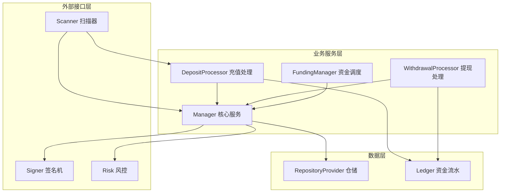
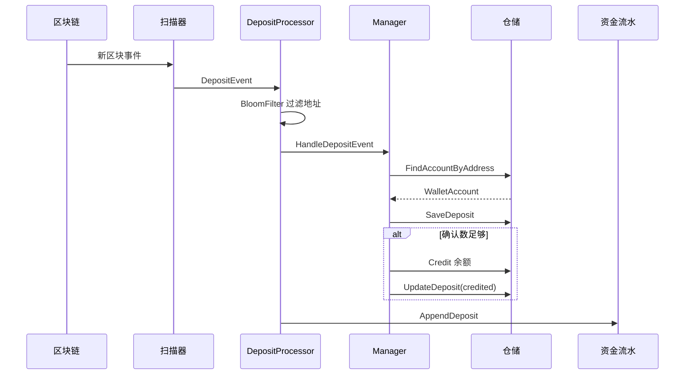
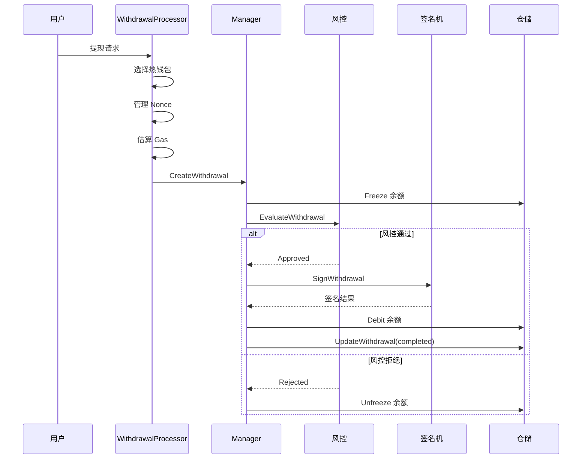
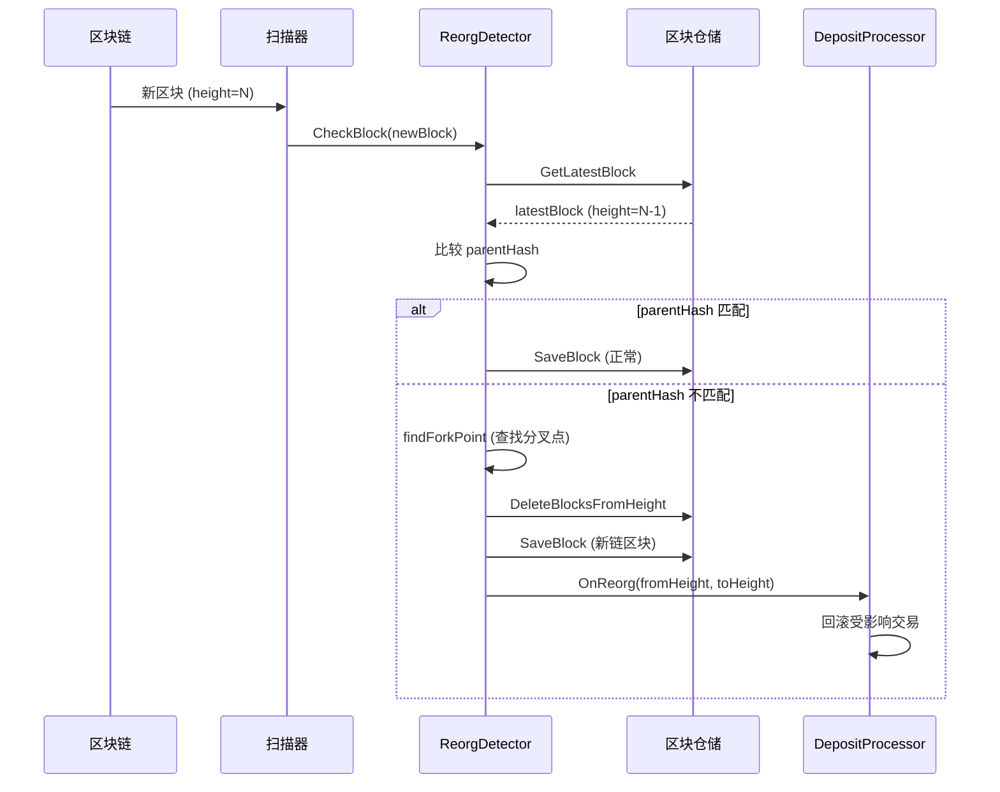

# 交易所钱包系统

基于 [lbc-team/cex-wallet](https://github.com/lbc-team/cex-wallet) 设计思路，使用 Go 语言实现的交易所钱包系统。提供安全的用户充值、提现、资金调度等核心功能。

## 📋 目录结构

```
internal/wallet/
├── domain/          # 领域模型和错误定义
├── store/           # 数据仓储层（接口和内存实现）
├── service/         # 核心业务服务（Manager）
├── scanner/         # 区块链扫描器接口和重组检测
├── deposit/         # 充值处理模块
├── withdrawal/      # 提现处理模块
├── signer/          # 签名机接口
├── risk/            # 风控接口
└── funding/         # 资金调度模块
```

## 🏗️ 架构设计



## 🔄 核心流程

### 1. 充值流程



### 2. 提现流程



### 3. 重组检测流程



## 📦 核心模块

### Domain（领域模型）

定义核心业务实体和错误类型。

**主要类型**：
- `Asset`: 资产配置
- `WalletAccount`: 用户钱包账户
- `Balance`: 余额信息（可用、冻结、待处理）
- `DepositRecord`: 充值记录
- `WithdrawalRequest`: 提现请求

**文档**: 详见代码注释

### Store（数据仓储）

提供数据访问抽象层，支持内存实现和数据库实现。

**接口**：
- `AssetRepository`: 资产管理
- `AccountRepository`: 账户管理
- `BalanceRepository`: 余额操作（Credit/Debit/Freeze/Unfreeze）
- `DepositRepository`: 充值记录
- `WithdrawalRepository`: 提现记录
- `BlockRepository`: 区块信息（用于重组检测）

**实现**：
- `InMemoryStore`: 内存实现，用于开发和测试

### Service（核心服务）

`Manager` 是系统的核心，协调各个模块完成业务逻辑。

**主要功能**：
- 资产注册和管理
- 用户账户创建
- 充值入账处理
- 提现审批和执行
- 余额查询和转账

**使用示例**：
```go
store := store.NewInMemoryStore()
manager := service.NewManager(store,
    service.WithRiskController(riskController),
    service.WithSigner(signer),
)

// 注册资产
manager.RegisterAsset(ctx, domain.Asset{
    Symbol: "ETH",
    Chain:  domain.ChainEVM,
    Decimals: 18,
})

// 创建账户
account, _ := manager.EnsureAccount(ctx, "user123", "ETH")

// 查询余额
balance, _ := manager.GetBalance(ctx, "user123", "ETH")
```

### Scanner（扫描器）

负责监听区块链新区块，检测充值交易和区块重组。

**接口**：
- `Scanner`: 扫描器接口
- `BlockFetcher`: 从 RPC 获取区块信息
- `ReorgDetector`: 重组检测器

**重组检测原理**：
1. 接收新区块，检查 `parentHash` 是否匹配
2. 如果不匹配，从 RPC 往上查找分叉点
3. 确定回滚范围，触发重组处理

**文档**: [scanner/reorg_detector_example.md](./scanner/reorg_detector_example.md)

### Deposit（充值模块）

处理用户充值流程，包括地址过滤、确认数检查、重组回滚等。

**核心组件**：
- `Processor`: 充值处理器
- `BloomFilter`: 布隆过滤器（快速地址匹配）
- `Ledger`: 资金流水表
- `ReorgHandler`: 重组处理器

**文档**: 
- [deposit/reorg_flow.md](./deposit/reorg_flow.md) - 重组处理流程图
- [deposit/reorg_example.md](./deposit/reorg_example.md) - 使用示例
- [deposit/reorg_depth.md](./deposit/reorg_depth.md) - 重组深度说明

### Withdrawal（提现模块）

处理用户提现流程，包括热钱包选择、Nonce 管理、Gas 估算等。

**核心组件**：
- `Processor`: 提现处理器
- `Selector`: 热钱包选择器
- `NonceManager`: Nonce 管理器
- `GasEstimator`: Gas 估算器
- `BatchBuilder`: 批量交易构建器（EIP-7702）

### Signer（签名机）

抽象签名机接口，实现私钥隔离。

**接口**：
- `GenerateAddress`: 生成地址
- `SignWithdrawal`: 签名提现交易

**安全设计**：
- 签名机部署在内网，不直接暴露于公网
- 默认提供 `NoopSigner` 用于开发测试

### Risk（风控）

风控系统接口，实现双重验证。

**接口**：
- `EvaluateWithdrawal`: 评估提现请求

**默认实现**：
- `NoopController`: 自动通过所有提现（开发测试用）

### Funding（资金调度）

管理热/温/冷钱包之间的资金平衡。

**核心组件**：
- `Manager`: 资金管理器
- `MultisigController`: 多签钱包控制器
- `RebalanceStrategy`: 资金调度策略

## 🚀 快速开始

### 1. 创建管理器

```go
import (
    "github.com/jinmu/go-blockchain/internal/wallet/domain"
    "github.com/jinmu/go-blockchain/internal/wallet/service"
    "github.com/jinmu/go-blockchain/internal/wallet/store"
)

// 创建仓储
store := store.NewInMemoryStore()

// 创建管理器
manager := service.NewManager(store)
```

### 2. 注册资产

```go
err := manager.RegisterAsset(ctx, domain.Asset{
    Symbol:   "ETH",
    Chain:    domain.ChainEVM,
    Decimals: 18,
})
```

### 3. 创建用户账户

```go
account, err := manager.EnsureAccount(ctx, "user123", "ETH")
// account.Address 就是用户的充值地址
```

### 4. 处理充值

```go
// 扫描器检测到充值后，调用
manager.HandleDepositEvent(ctx, domain.DepositEvent{
    Chain:       domain.ChainEVM,
    AssetSymbol: "ETH",
    ToAddress:   account.Address,
    Amount:      big.NewInt(1000000000000000000), // 1 ETH
    TxHash:      "0x...",
    BlockHeight: 12345,
})
```

### 5. 处理提现

```go
req := domain.WithdrawalRequest{
    ID:          "withdraw-001",
    UserID:      "user123",
    AssetSymbol: "ETH",
    Chain:       domain.ChainEVM,
    ToAddress:   "0x...",
    Amount:      big.NewInt(500000000000000000), // 0.5 ETH
}

result, err := manager.CreateWithdrawal(ctx, req)
```

## 🔒 安全设计

1. **签名机隔离**：私钥存储在签名机，不暴露给业务系统
2. **双重验证**：数据库网关 + 风控系统
3. **资金流水**：所有操作记录到 Ledger，支持审计和回滚
4. **重组处理**：自动检测和处理区块重组，保证数据一致性

## 📊 监控和告警

建议监控以下指标：
- 充值/提现成功率
- 重组发生频率和深度
- 余额一致性检查
- 签名机可用性
- 风控拒绝率

## 🔄 扩展点

系统设计支持灵活扩展：

1. **替换仓储实现**：实现 `RepositoryProvider` 接口，连接真实数据库
2. **自定义扫描器**：实现 `Scanner` 接口，支持不同链
3. **集成风控系统**：实现 `RiskController` 接口
4. **集成签名机**：实现 `Signer` 接口
5. **自定义资金策略**：实现 `RebalanceStrategy` 接口

## 📚 详细文档

- [充值模块文档](./deposit/) - 充值处理和重组回滚
- [扫描器文档](./scanner/) - 区块扫描和重组检测
- [服务层文档](./service/) - 核心业务逻辑

## 📝 注意事项

1. **生产环境**：必须替换内存仓储为数据库实现
2. **签名机**：必须使用真实的签名机实现，不要使用 `NoopSigner`
3. **风控系统**：必须集成真实的风控服务
4. **并发安全**：确保数据库操作是并发安全的
5. **错误处理**：实现完善的错误处理和日志记录

## 🤝 贡献

欢迎提交 Issue 和 Pull Request。

## 📄 许可证

MIT License
