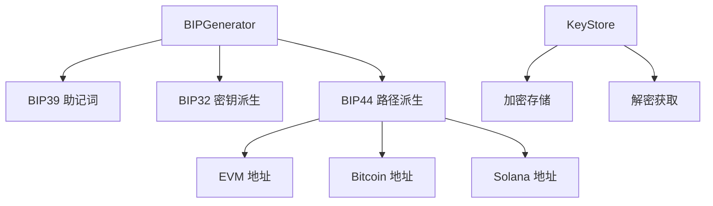
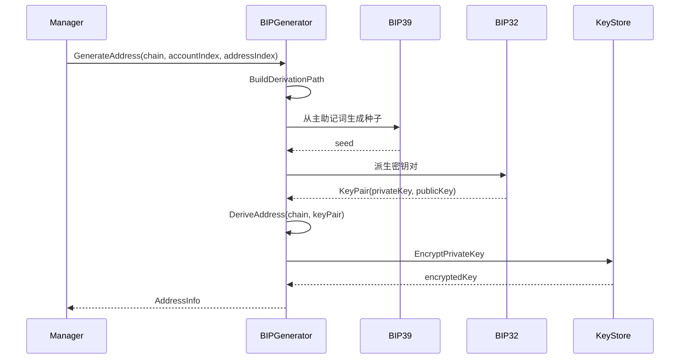
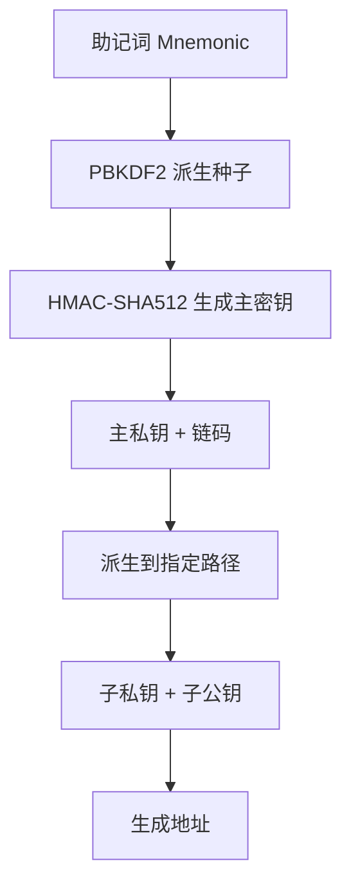

# BIP 模块 - 钱包分层协议

BIP 模块实现 BIP32/BIP44 钱包分层协议，提供助记词生成、私钥派生、地址生成等功能。

## 📋 功能概述

1. **助记词生成**：基于 BIP39 生成助记词
2. **钱包派生**：基于 BIP32 从种子派生主密钥
3. **地址派生**：基于 BIP44 派生不同链的地址
4. **私钥管理**：加密存储和管理私钥

## 🏗️ 架构设计



## 📖 BIP44 派生路径

### 路径格式

```
m / purpose' / coin_type' / account' / change / address_index
```

### 路径说明

- **purpose**: 44 (BIP44)
- **coin_type**: 币种类型
  - 0: Bitcoin
  - 60: Ethereum
  - 501: Solana
- **account**: 账户索引（通常为 0）
- **change**: 0 (外部链，充值地址), 1 (找零链)
- **address_index**: 地址索引（每个用户/资产使用不同索引）

### 示例路径

```
m/44'/60'/0'/0/0   # Ethereum 第一个地址
m/44'/60'/0'/0/1   # Ethereum 第二个地址
m/44'/0'/0'/0/0    # Bitcoin 第一个地址
m/44'/501'/0'/0/0  # Solana 第一个地址
```

## 🔄 核心流程

### 地址生成流程



### 密钥派生流程



## 📦 核心组件

### Generator

钱包生成器接口，提供地址生成功能。

```go
type Generator interface {
    GenerateMnemonic(strength int) (string, error)
    GenerateWalletFromMnemonic(mnemonic string, password string) (*WalletInfo, error)
    DeriveKeyPair(wallet *WalletInfo, path DerivationPath) (*KeyPair, error)
    DeriveAddress(chain domain.ChainType, keyPair *KeyPair) (string, error)
    GenerateAddress(ctx context.Context, chain domain.ChainType, accountIndex, addressIndex uint32, metadata map[string]string) (*AddressInfo, error)
}
```

### DerivationPath

派生路径结构。

```go
type DerivationPath struct {
    Purpose      uint32 // 44
    CoinType     uint32 // 60 (Ethereum), 0 (Bitcoin)
    Account      uint32 // 账户索引
    Change       uint32 // 0 或 1
    AddressIndex uint32 // 地址索引
}
```

### KeyStore

密钥存储接口，用于加密存储私钥。

```go
type KeyStore interface {
    SaveKey(ctx context.Context, address string, encryptedKey []byte) error
    GetKey(ctx context.Context, address string) ([]byte, error)
    DeleteKey(ctx context.Context, address string) error
}
```

## 💡 使用示例

### 基本使用

```go
import (
    "github.com/jinmu/go-blockchain/internal/wallet/bip"
    "github.com/jinmu/go-blockchain/internal/wallet/domain"
)

// 1. 创建生成器（使用主助记词）
generator := bip.NewBIPGenerator(masterMnemonic, masterPassword)

// 2. 生成地址
// accountIndex: 通常为 0
// addressIndex: 根据用户ID或资产生成唯一索引
addressInfo, err := generator.GenerateAddress(
    ctx,
    domain.ChainEVM,
    0,  // accountIndex
    123, // addressIndex (可以根据 userID 哈希生成)
    map[string]string{
        "user_id": "user123",
        "asset": "ETH",
    },
)

fmt.Printf("Address: %s\n", addressInfo.Address)
fmt.Printf("Path: %s\n", bip.FormatDerivationPath(addressInfo.Path))
```

### 构建派生路径

```go
// 为 Ethereum 构建路径
path := bip.BuildDerivationPath(domain.ChainEVM, 0, 123)
// 结果: m/44'/60'/0'/0/123

// 格式化路径
pathStr := bip.FormatDerivationPath(path)
fmt.Println(pathStr) // m/44'/60'/0'/0/123
```

### 加密存储私钥

```go
// 加密私钥
encrypted, err := bip.EncryptPrivateKey(privateKey, password)
if err != nil {
    log.Fatal(err)
}

// 保存到 KeyStore
keystore.SaveKey(ctx, address, encrypted)

// 解密私钥
decrypted, err := bip.DecryptPrivateKey(encrypted, password)
if err != nil {
    log.Fatal(err)
}
```

### 与 Signer 集成

```go
type BIPSigner struct {
    generator *bip.BIPGenerator
    keystore  bip.KeyStore
}

func (s *BIPSigner) GenerateAddress(ctx context.Context, chain domain.ChainType, metadata map[string]string) (string, error) {
    // 从 metadata 获取索引
    userID := metadata["user_id"]
    asset := metadata["asset"]
    
    // 生成唯一索引（例如：hash(userID + asset) % maxIndex）
    addressIndex := generateIndex(userID, asset)
    
    // 生成地址
    addressInfo, err := s.generator.GenerateAddress(ctx, chain, 0, addressIndex, metadata)
    if err != nil {
        return "", err
    }
    
    // 保存加密私钥
    if err := s.keystore.SaveKey(ctx, addressInfo.Address, addressInfo.PrivateKey); err != nil {
        return "", err
    }
    
    return addressInfo.Address, nil
}
```

## 📊 地址索引生成策略

### 方案 1: 基于用户ID和资产

```go
func generateAddressIndex(userID, asset string) uint32 {
    hash := sha256.Sum256([]byte(userID + ":" + asset))
    index := binary.BigEndian.Uint32(hash[:4])
    return index % 1000000 // 限制在合理范围内
}
```

### 方案 2: 自增索引

```go
// 从数据库获取下一个可用索引
func getNextAddressIndex(chain domain.ChainType) (uint32, error) {
    // 查询数据库中该链的最大索引
    maxIndex := db.GetMaxAddressIndex(chain)
    return maxIndex + 1, nil
}
```

### 方案 3: 哈希映射

```go
// 使用一致性哈希确保相同用户+资产总是得到相同地址
func getAddressIndex(userID, asset string) uint32 {
    key := userID + ":" + asset
    hash := fnv.New32a()
    hash.Write([]byte(key))
    return hash.Sum32() % 1000000
}
```

## 🔒 安全设计

### 1. 主助记词管理

- 主助记词存储在签名机，不暴露给业务系统
- 使用硬件安全模块（HSM）保护
- 定期备份，多重签名验证

### 2. 私钥加密

- 使用 AES-256-GCM 加密
- 使用 scrypt 派生加密密钥
- 每个私钥使用独立的 salt

### 3. 路径隔离

- 不同用户使用不同的 addressIndex
- 不同资产使用不同的路径
- 充值地址和找零地址分离

## ⚠️ 注意事项

1. **依赖库**：需要引入 `bip39` 和 `bip32` 库
   ```go
   // 推荐使用以下库：
   // github.com/tyler-smith/go-bip32
   // github.com/tyler-smith/go-bip39
   ```

2. **主助记词**：必须安全保管，丢失无法恢复

3. **索引管理**：确保地址索引的唯一性

4. **私钥加密**：所有私钥必须加密存储

5. **路径规范**：严格按照 BIP44 规范使用路径

## 🔧 实现依赖

需要添加以下依赖：

```go
// go get github.com/tyler-smith/go-bip32
// go get github.com/tyler-smith/go-bip39
// go get golang.org/x/crypto/scrypt
```

## 📚 参考

- [BIP32](https://github.com/bitcoin/bips/blob/master/bip-0032.mediawiki) - 分层确定性钱包
- [BIP39](https://github.com/bitcoin/bips/blob/master/bip-0039.mediawiki) - 助记词
- [BIP44](https://github.com/bitcoin/bips/blob/master/bip-0044.mediawiki) - 多账户层次结构
- [SLIP-0044](https://github.com/satoshilabs/slips/blob/master/slip-0044.md) - 注册的币种类型

