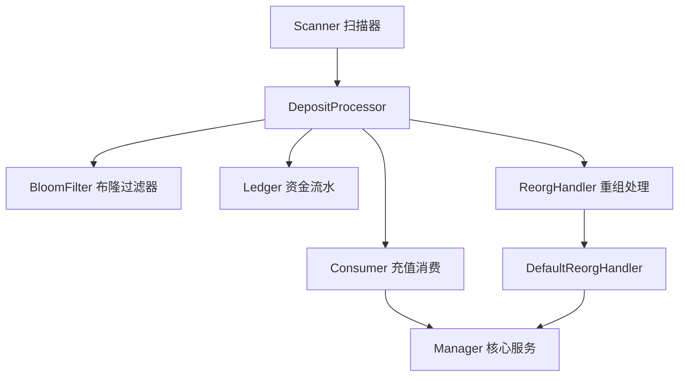
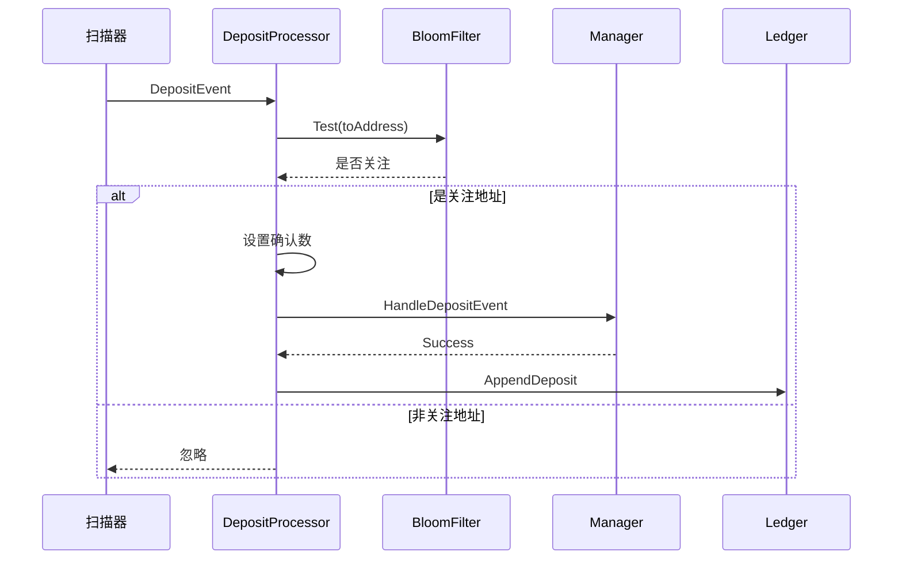
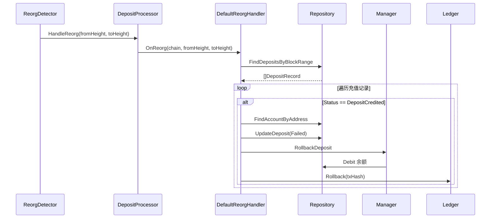
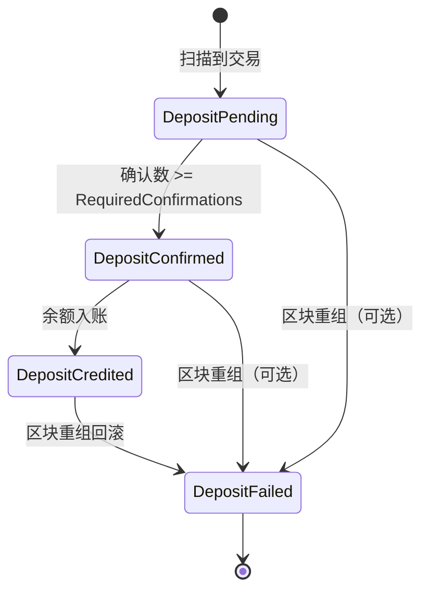

# Deposit 模块 - 充值处理

充值模块负责处理用户充值流程，包括地址过滤、确认数检查、资金流水记录和区块重组回滚。

## 📋 功能概述

1. **地址过滤**：使用布隆过滤器快速判断是否为关注地址
2. **确认数检查**：等待足够的区块确认后再入账
3. **资金流水**：记录所有充值操作，支持审计和回滚
4. **重组回滚**：自动检测和处理区块重组，回滚受影响交易

## 🏗️ 架构设计



## 🔄 核心流程

### 充值处理流程



### 重组回滚流程



## 📖 核心组件

### Processor

充值处理器，协调各个组件完成充值流程。

**主要方法**：
- `HandleEvent`: 处理充值事件
- `PreloadAddress`: 预加载地址到布隆过滤器
- `ShouldHandle`: 判断是否处理该地址
- `HandleReorg`: 处理区块重组

### BloomFilter

布隆过滤器接口，用于快速判断地址是否在关注列表中。

**接口**：
```go
type BloomFilter interface {
    Add(item []byte)
    Test(item []byte) bool
}
```

**优势**：
- 快速判断，O(1) 时间复杂度
- 内存占用小
- 支持大量地址

### Ledger

资金流水表接口，记录所有充值操作。

**接口**：
```go
type Ledger interface {
    AppendDeposit(ctx context.Context, record domain.DepositRecord) error
    AppendWithdrawal(ctx context.Context, req domain.WithdrawalRequest) error
    Rollback(ctx context.Context, reference string) error
}
```

**用途**：
- 审计追踪
- 数据回滚
- 对账核对

### ReorgHandler

重组处理器接口，处理区块重组回滚。

**接口**：
```go
type ReorgHandler interface {
    OnReorg(ctx context.Context, chain domain.ChainType, fromHeight, toHeight uint64) error
}
```

**实现**：
- `DefaultReorgHandler`: 默认实现，支持按链类型配置重组深度

## 💡 使用示例

### 基本使用

```go
import (
    "github.com/jinmu/go-blockchain/internal/wallet/deposit"
    "github.com/jinmu/go-blockchain/internal/wallet/service"
)

// 1. 创建组件
bloom := NewBloomFilter() // 实现 BloomFilter 接口
ledger := NewLedger()     // 实现 Ledger 接口
manager := service.NewManager(store)

// 2. 创建重组处理器
reorgHandler := deposit.NewDefaultReorgHandlerWithConfig(
    store,
    manager,
    ledger,
    deposit.DefaultReorgDepths, // 使用默认配置
)

// 3. 创建充值处理器
processor := deposit.NewProcessor(
    manager,        // Consumer
    bloom,          // BloomFilter
    ledger,         // Ledger
    reorgHandler,   // ReorgHandler
    12,             // 确认数要求
)

// 4. 预加载地址
processor.PreloadAddress("0x123...")
processor.PreloadAddress("0x456...")

// 5. 处理充值事件
err := processor.HandleEvent(ctx, domain.DepositEvent{
    Chain:       domain.ChainEVM,
    AssetSymbol: "ETH",
    ToAddress:   "0x123...",
    Amount:      big.NewInt(1000000000000000000),
    TxHash:      "0x789...",
    BlockHeight: 12345,
    Confirmations: 12,
})
```

### 自定义重组深度

```go
// 自定义各链的重组深度
config := deposit.ReorgDepthConfig{
    domain.ChainBitcoin: 6,
    domain.ChainEVM:    15,  // 更保守
    domain.ChainSolana: 50,
}

reorgHandler := deposit.NewDefaultReorgHandlerWithConfig(
    store,
    manager,
    ledger,
    config,
)
```

## 📊 状态流转



## 🔍 详细文档

- [reorg_flow.md](./reorg_flow.md) - 重组处理详细流程图
- [reorg_example.md](./reorg_example.md) - 重组处理使用示例
- [reorg_depth.md](./reorg_depth.md) - 重组深度配置说明

## ⚠️ 注意事项

1. **布隆过滤器**：需要定期更新，添加新地址
2. **确认数**：根据链类型设置合适的确认数要求
3. **重组深度**：根据链特性配置重组深度，参考 [reorg_depth.md](./reorg_depth.md)
4. **并发安全**：确保 Ledger 和 Store 操作是并发安全的
5. **错误处理**：妥善处理各种错误情况，记录日志

## 🔧 扩展

可以通过实现接口来扩展功能：

1. **自定义布隆过滤器**：实现 `BloomFilter` 接口
2. **自定义资金流水**：实现 `Ledger` 接口
3. **自定义重组处理**：实现 `ReorgHandler` 接口

