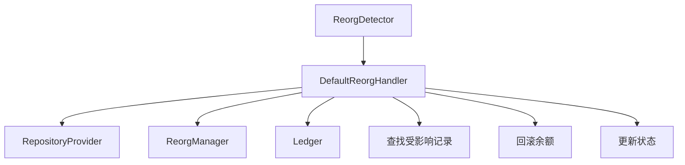

# 区块重组（Reorg）处理逻辑说明

## 📋 设计概述

当区块链发生重组时，之前已确认并可能已入账的充值交易可能被回滚。`DefaultReorgHandler` 负责检测并处理这种情况，确保系统数据一致性。

## 🏗️ 架构设计



## 处理流程

### 1. 触发条件

- 扫描器检测到区块重组（例如：新链分叉点高度为 `blockHeight`）
- 调用 `Processor.HandleReorg()` → `ReorgHandler.OnReorg()`

### 2. 查找受影响记录

```go
// 计算回滚范围：从 blockHeight 往前回滚 reorgDepth 个区块（默认 6 个）
fromHeight = blockHeight - reorgDepth
toHeight = blockHeight

// 查询该范围内的所有充值记录
records = FindDepositsByBlockRange(chain, fromHeight, toHeight)
```

### 3. 筛选需要回滚的记录

只处理状态为 `DepositCredited`（已入账）的记录：
- `DepositPending` / `DepositConfirmed`：尚未入账，无需回滚
- `DepositCredited`：已入账，需要回滚余额
- `DepositFailed`：已标记失败，跳过

### 4. 回滚操作

对每条需要回滚的记录：

1. **更新充值记录状态**
   ```go
   record.Status = DepositFailed
   UpdateDeposit(record)
   ```

2. **回滚用户余额**
   - 如果提供了 `ReorgManager`：调用 `manager.RollbackDeposit()`（单笔处理）
   - 否则：批量聚合后调用 `Debit()` 扣除余额

3. **回滚资金流水**
   ```go
   ledger.Rollback(txHash)  // 标记流水为已回滚
   ```

### 5. 批量优化

按 `userID:asset` 聚合回滚金额，减少数据库操作次数：

```go
rollbackStats[userID:asset] = {
    totalAmount: sum(所有受影响记录的金额),
    records: [记录列表]
}
```

## 使用示例

```go
// 1. 创建重组处理器
reorgHandler := deposit.NewDefaultReorgHandler(
    store,           // 仓储接口
    manager,         // 可选：提供 RollbackDeposit 方法
    ledger,          // 可选：资金流水表
    6,              // 重组深度（默认 6 个区块）
)

// 2. 注册到 Processor
processor := deposit.NewProcessor(consumer, bloom, ledger, reorgHandler, confirmations)

// 3. 扫描器检测到重组时调用
scanner.OnReorgDetected(chain, blockHeight) {
    processor.HandleReorg(ctx, chain, blockHeight)
}
```

## 注意事项

1. **幂等性**：多次调用 `OnReorg` 应该安全（已回滚的记录不会重复处理）

2. **并发安全**：重组处理期间，相关充值记录应该加锁，避免并发入账

3. **错误处理**：
   - Ledger 回滚失败不影响主流程（记录告警）
   - 账户查找失败跳过该记录（记录日志）
   - 余额扣减失败立即返回错误

4. **性能优化**：
   - 批量查询受影响记录
   - 按用户+资产聚合回滚操作
   - 可选的异步处理（生产环境建议）

5. **监控告警**：
   - 重组发生频率
   - 回滚金额统计
   - 回滚失败记录

## 扩展点

- **自定义重组深度**：根据链的特性调整 `reorgDepth`
- **部分回滚策略**：某些链可能只需要回滚部分区块
- **提现回滚**：如果提现交易在重组区块中，也需要相应处理（当前实现仅处理充值）

