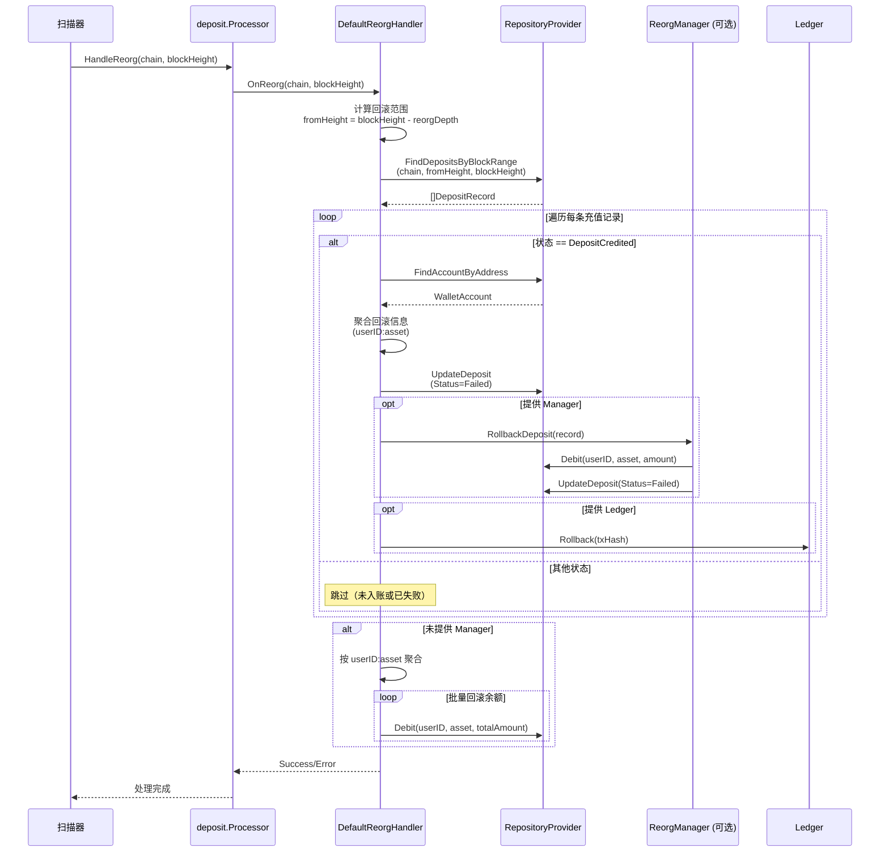
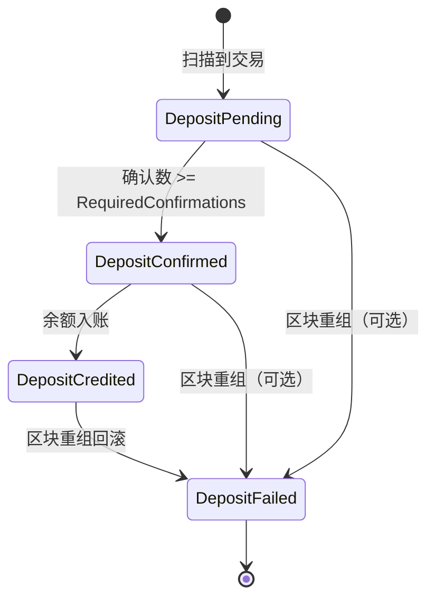
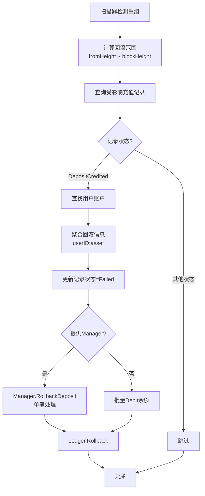

# 区块重组处理流程图

## 时序图



## 状态转换图



## 数据流图



## 核心代码逻辑

### 1. 查找受影响记录

```go
// 计算回滚范围
fromHeight := blockHeight - reorgDepth  // 默认回滚 6 个区块
toHeight := blockHeight

// 查询该范围内的所有充值记录
records, err := repos.FindDepositsByBlockRange(ctx, chain, fromHeight, toHeight)
```

### 2. 筛选并聚合

```go
rollbackStats := make(map[string]*rollbackInfo)  // key: userID:asset

for _, record := range records {
    if record.Status != domain.DepositCredited {
        continue  // 只回滚已入账的
    }
    
    account, _ := repos.FindAccountByAddress(ctx, record.ToAddress, record.AssetSymbol)
    key := account.UserID + ":" + record.AssetSymbol
    
    // 聚合金额
    rollbackStats[key].totalAmount += record.Amount
}
```

### 3. 执行回滚

```go
// 方式1：使用 Manager（推荐，包含业务逻辑）
if manager != nil {
    for _, record := range info.records {
        manager.RollbackDeposit(ctx, record)  // 内部会 Debit + UpdateDeposit
    }
}

// 方式2：直接批量 Debit
else {
    for _, info := range rollbackStats {
        repos.Debit(ctx, info.userID, info.asset, info.totalAmount)
    }
}
```

## 关键设计点

1. **只回滚已入账记录**：`DepositCredited` 状态才需要回滚余额
2. **批量优化**：按 `userID:asset` 聚合，减少数据库操作
3. **可选组件**：Manager 和 Ledger 都是可选的，提供灵活性
4. **错误隔离**：单条记录失败不影响其他记录的处理
5. **幂等性**：重复调用应该安全（已回滚的记录状态为 Failed）

