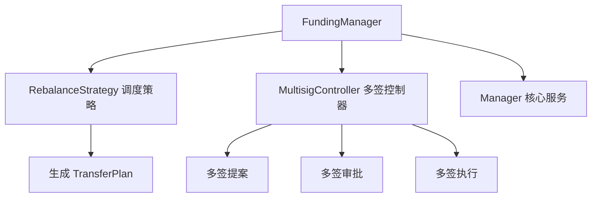
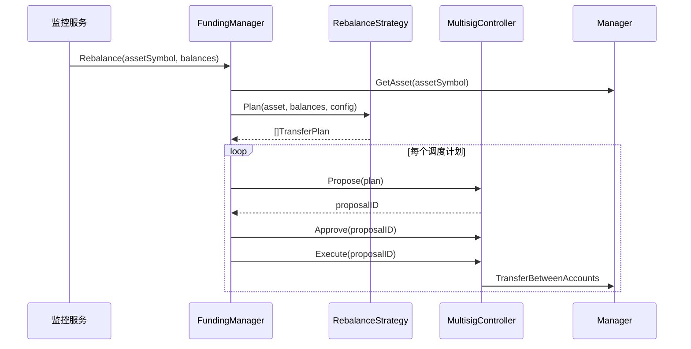
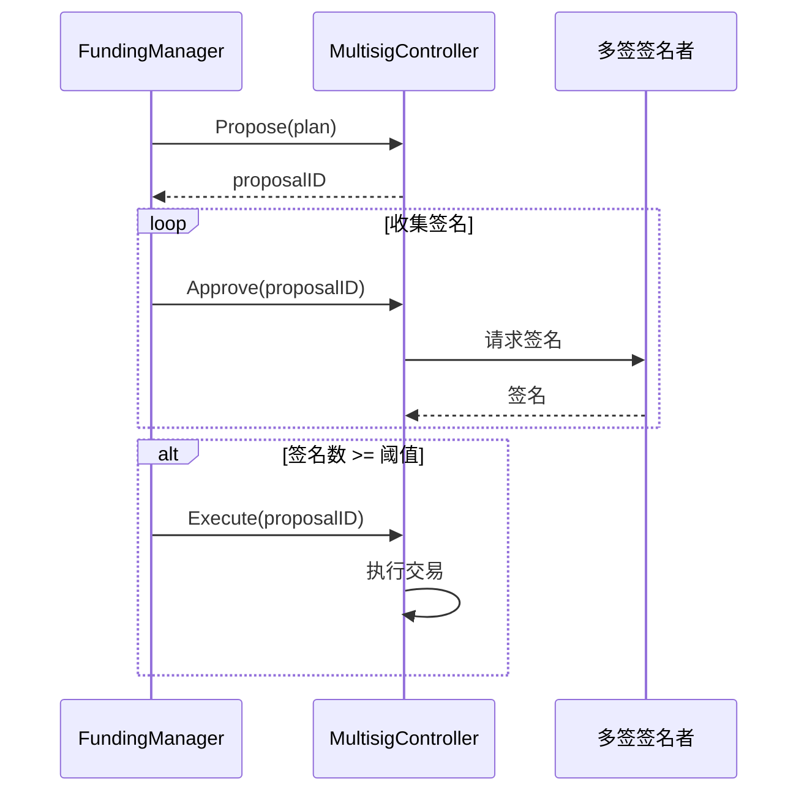
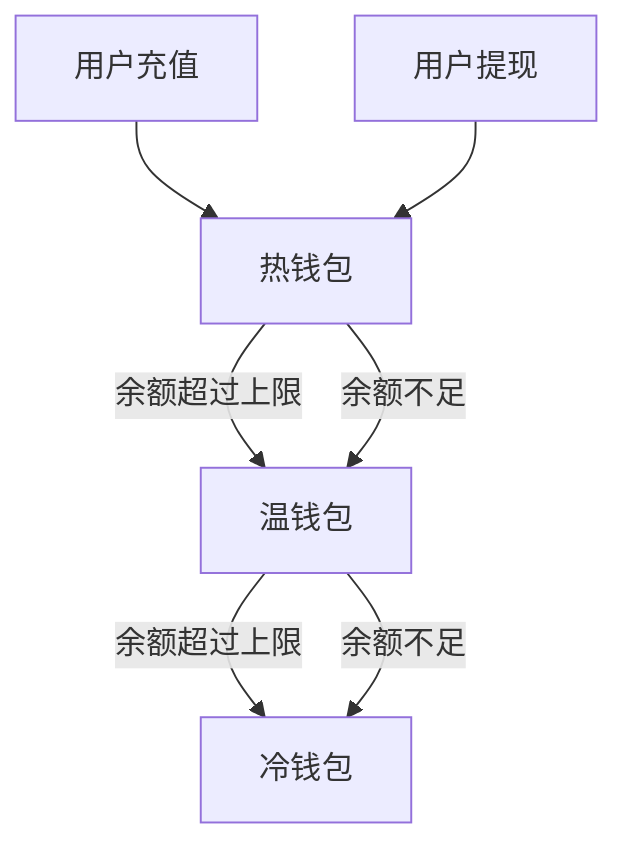

# Funding 模块 - 资金调度

资金调度模块负责管理热/温/冷钱包之间的资金平衡，使用多签钱包进行资金归集。

## 📋 功能概述

1. **资金归集**：将热钱包资金归集到冷钱包
2. **资金下发**：从冷钱包下发资金到热钱包
3. **余额平衡**：根据配置自动平衡各层级钱包余额
4. **多签管理**：使用多签钱包确保资金安全

## 🏗️ 架构设计



## 🔄 核心流程

### 资金归集流程



### 多签流程



## 📖 核心组件

### Manager

资金管理器，协调策略和多签控制器。

**主要方法**：
- `Rebalance`: 执行资金调度

### RebalanceStrategy

资金调度策略接口。

```go
type RebalanceStrategy interface {
    Plan(ctx context.Context, asset domain.Asset, balances map[string]*big.Int, cfg TreasuryConfig) ([]domain.TransferPlan, error)
}
```

**策略示例**：
- 热钱包余额超过上限 → 归集到温钱包
- 热钱包余额低于下限 → 从温钱包下发
- 温钱包余额超过上限 → 归集到冷钱包

### MultisigController

多签钱包控制器接口。

```go
type MultisigController interface {
    Propose(ctx context.Context, plan domain.TransferPlan) (string, error)
    Approve(ctx context.Context, proposalID string) error
    Execute(ctx context.Context, proposalID string) error
}
```

### TreasuryConfig

资金层级配置。

```go
type TreasuryConfig struct {
    HotWalletLimit  *big.Int // 热钱包上限
    WarmWalletLimit *big.Int // 温钱包上限
    ColdWalletLimit *big.Int // 冷钱包上限
}
```

## 💡 使用示例

### 基本使用

```go
import (
    "github.com/jinmu/go-blockchain/internal/wallet/funding"
    "github.com/jinmu/go-blockchain/internal/wallet/service"
)

// 1. 创建组件
manager := service.NewManager(store)
multisig := NewMultisigController() // 实现 MultisigController
strategy := NewRebalanceStrategy()  // 实现 RebalanceStrategy

config := funding.TreasuryConfig{
    HotWalletLimit:  big.NewInt(10000000000000000000),  // 10 ETH
    WarmWalletLimit: big.NewInt(100000000000000000000), // 100 ETH
    ColdWalletLimit: big.NewInt(0), // 无上限
}

// 2. 创建资金管理器
fundingMgr := funding.NewManager(manager, multisig, strategy, config)

// 3. 执行资金调度
balances := map[string]*big.Int{
    "hot_wallet_1":  big.NewInt(15000000000000000000),  // 15 ETH
    "warm_wallet_1": big.NewInt(50000000000000000000),  // 50 ETH
    "cold_wallet_1": big.NewInt(1000000000000000000000), // 1000 ETH
}

err := fundingMgr.Rebalance(ctx, "ETH", balances)
```

### 实现调度策略

```go
type SimpleRebalanceStrategy struct{}

func (s *SimpleRebalanceStrategy) Plan(ctx context.Context, asset domain.Asset, balances map[string]*big.Int, cfg funding.TreasuryConfig) ([]domain.TransferPlan, error) {
    var plans []domain.TransferPlan
    
    // 检查热钱包
    for address, balance := range balances {
        if isHotWallet(address) {
            if balance.Cmp(cfg.HotWalletLimit) > 0 {
                // 超过上限，归集到温钱包
                excess := new(big.Int).Sub(balance, cfg.HotWalletLimit)
                plans = append(plans, domain.TransferPlan{
                    FromAddress: address,
                    ToAddress:   getWarmWallet(),
                    Amount:      excess,
                })
            } else if balance.Cmp(cfg.HotWalletLimit) < 0 {
                // 低于下限，从温钱包下发
                deficit := new(big.Int).Sub(cfg.HotWalletLimit, balance)
                plans = append(plans, domain.TransferPlan{
                    FromAddress: getWarmWallet(),
                    ToAddress:   address,
                    Amount:      deficit,
                })
            }
        }
    }
    
    return plans, nil
}
```

### 实现多签控制器

```go
type GnosisSafeController struct {
    client *ethclient.Client
    safeAddress common.Address
}

func (g *GnosisSafeController) Propose(ctx context.Context, plan domain.TransferPlan) (string, error) {
    // 创建多签提案
    // 返回 proposalID
}

func (g *GnosisSafeController) Approve(ctx context.Context, proposalID string) error {
    // 审批提案（签名）
}

func (g *GnosisSafeController) Execute(ctx context.Context, proposalID string) error {
    // 执行提案（当签名数足够时）
}
```

## 📊 钱包层级



**钱包层级说明**：
- **热钱包**：用于日常提现，余额较小，风险较高
- **温钱包**：中间层，缓冲热钱包和冷钱包
- **冷钱包**：长期存储，余额最大，最安全

## ⚠️ 注意事项

1. **多签阈值**：设置合理的多签阈值（如 2/3）
2. **调度频率**：定期执行资金调度，避免频繁调度
3. **余额监控**：实时监控各层级钱包余额
4. **安全审计**：记录所有资金调度操作
5. **异常处理**：处理多签失败、网络异常等情况

## 🔧 扩展

可以通过实现接口来支持：

1. **自定义策略**：实现 `RebalanceStrategy` 接口
2. **多签协议**：支持 Gnosis Safe、MultiSig 等
3. **自动化调度**：定时任务自动执行调度
4. **智能路由**：根据网络状况选择最优路径

