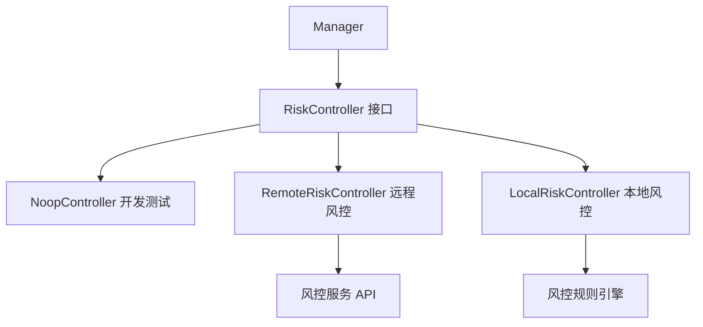
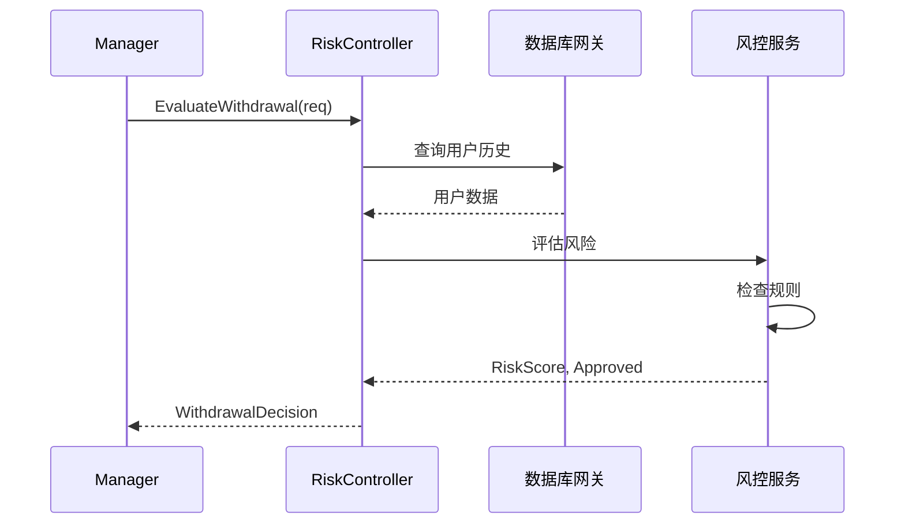

# Risk 模块 - 风控系统

风控模块提供提现风险评估和审批功能，实现双重验证。

## 📋 功能概述

1. **风险评估**：评估提现请求的风险等级
2. **审批决策**：决定是否批准提现
3. **双重验证**：结合数据库网关和风控系统

## 🏗️ 架构设计



## 🔄 核心流程

### 风控评估流程



## 📖 接口说明

### Controller 接口

```go
type Controller interface {
    EvaluateWithdrawal(ctx context.Context, req domain.WithdrawalRequest) (domain.WithdrawalDecision, error)
}
```

### WithdrawalDecision 结构

```go
type WithdrawalDecision struct {
    Approved bool              // 是否批准
    Score    float64           // 风险评分 (0-1)
    Remarks  string            // 备注说明
    Metadata map[string]string // 额外元数据
}
```

## 💡 使用示例

### 使用默认实现（开发测试）

```go
import (
    "github.com/jinmu/go-blockchain/internal/wallet/risk"
    "github.com/jinmu/go-blockchain/internal/wallet/service"
)

// 使用 NoopController（自动通过所有提现）
manager := service.NewManager(store,
    service.WithRiskController(risk.NoopController{}),
)
```

### 实现远程风控

```go
type RemoteRiskController struct {
    client *http.Client
    url    string
}

func (r *RemoteRiskController) EvaluateWithdrawal(ctx context.Context, req domain.WithdrawalRequest) (domain.WithdrawalDecision, error) {
    // 调用远程风控服务
    riskReq := RiskEvaluationRequest{
        UserID:    req.UserID,
        Amount:    req.Amount.String(),
        ToAddress: req.ToAddress,
        Asset:     req.AssetSymbol,
    }
    
    resp, err := r.client.Post(r.url+"/evaluate", "application/json", riskReq)
    if err != nil {
        return domain.WithdrawalDecision{Approved: false}, err
    }
    
    var result RiskEvaluationResponse
    json.NewDecoder(resp.Body).Decode(&result)
    
    return domain.WithdrawalDecision{
        Approved: result.Approved,
        Score:    result.Score,
        Remarks:  result.Remarks,
    }, nil
}
```

### 实现本地风控规则

```go
type LocalRiskController struct {
    rules []RiskRule
}

func (r *LocalRiskController) EvaluateWithdrawal(ctx context.Context, req domain.WithdrawalRequest) (domain.WithdrawalDecision, error) {
    score := 0.0
    remarks := []string{}
    
    // 规则1: 金额检查
    if req.Amount.Cmp(big.NewInt(1000000000000000000)) > 0 { // > 1 ETH
        score += 0.3
        remarks = append(remarks, "大额提现")
    }
    
    // 规则2: 地址检查
    if isBlacklisted(req.ToAddress) {
        return domain.WithdrawalDecision{
            Approved: false,
            Score:    1.0,
            Remarks:  "目标地址在黑名单中",
        }, nil
    }
    
    // 规则3: 频率检查
    recentCount := getRecentWithdrawalCount(req.UserID)
    if recentCount > 10 {
        score += 0.2
        remarks = append(remarks, "提现频率过高")
    }
    
    approved := score < 0.5
    return domain.WithdrawalDecision{
        Approved: approved,
        Score:    score,
        Remarks:  strings.Join(remarks, "; "),
    }, nil
}
```

## 🔍 风控规则示例

### 1. 金额限制

```go
// 单笔提现限额
if amount > dailyLimit {
    return Rejected
}

// 累计提现限额
if totalAmount > monthlyLimit {
    return Rejected
}
```

### 2. 地址检查

```go
// 黑名单检查
if isBlacklisted(toAddress) {
    return Rejected
}

// 白名单检查
if !isWhitelisted(toAddress) && amount > threshold {
    return Rejected
}
```

### 3. 频率限制

```go
// 提现频率
if withdrawalCount > maxCountPerDay {
    return Rejected
}

// 时间间隔
if timeSinceLastWithdrawal < minInterval {
    return Rejected
}
```

### 4. 用户行为

```go
// 账户年龄
if accountAge < minAge {
    score += 0.2
}

// 历史交易
if hasSuspiciousHistory(userID) {
    score += 0.3
}
```

## 📊 风险评分

风险评分范围：0.0 - 1.0

- **0.0 - 0.3**: 低风险，自动通过
- **0.3 - 0.5**: 中风险，需要人工审核
- **0.5 - 0.7**: 高风险，拒绝或人工审核
- **0.7 - 1.0**: 极高风险，直接拒绝

## ⚠️ 注意事项

1. **双重验证**：结合数据库网关和风控系统，确保数据一致性
2. **实时性**：风控评估应该快速响应，避免影响用户体验
3. **规则更新**：支持动态更新风控规则
4. **日志记录**：记录所有风控决策，用于审计和分析
5. **误报处理**：提供人工审核机制，处理误报情况

## 🔧 扩展

可以通过实现 `Controller` 接口来支持：

1. **机器学习模型**：使用 ML 模型评估风险
2. **第三方风控服务**：集成第三方风控 API
3. **多维度评估**：结合多个数据源评估
4. **实时规则引擎**：使用规则引擎动态评估

