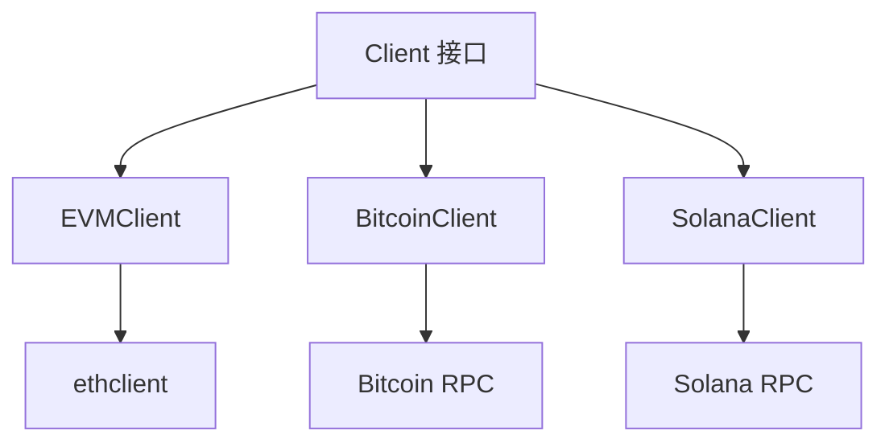

# RPC 模块 - 统一 RPC 客户端

RPC 模块提供统一的区块链 RPC 客户端接口，封装不同链的 RPC 请求和响应。

## 📋 功能概述

1. **统一接口**：为不同链提供统一的 RPC 调用接口
2. **类型定义**：统一的请求/响应数据结构
3. **链实现**：支持 EVM、Bitcoin、Solana 等不同链
4. **错误处理**：统一的错误处理机制

## 🏗️ 架构设计



## 📖 核心接口

### Client 接口

统一的 RPC 客户端接口，所有链实现都需要实现：

```go
type Client interface {
    Chain() domain.ChainType
    GetBlockByHeight(ctx context.Context, height uint64) (*BlockInfo, error)
    GetBlockByHash(ctx context.Context, hash string) (*BlockInfo, error)
    GetLatestBlock(ctx context.Context) (*BlockInfo, error)
    GetTransaction(ctx context.Context, txHash string) (*TransactionInfo, error)
    GetBalance(ctx context.Context, address string) (*BalanceInfo, error)
    EstimateGas(ctx context.Context, from, to string, value *big.Int, data []byte) (*GasEstimation, error)
    GetFeeHistory(ctx context.Context, blockCount uint64, newestBlock string) (*FeeHistory, error)
    SendRawTransaction(ctx context.Context, rawTx []byte) (string, error)
    GetTransactionReceipt(ctx context.Context, txHash string) (*TransactionInfo, error)
}
```

## 📦 统一类型

### BlockInfo

区块信息（所有链统一格式）：

```go
type BlockInfo struct {
    Height     uint64
    Hash       string
    ParentHash string
    Timestamp  uint64
    TxCount    uint64
}
```

### TransactionInfo

交易信息（所有链统一格式）：

```go
type TransactionInfo struct {
    Hash        string
    From        string
    To          string
    Value       *big.Int
    GasPrice    *big.Int
    GasLimit    uint64
    Nonce       uint64
    BlockHeight uint64
    BlockHash   string
    Status      uint64
}
```

### GasEstimation

Gas 估算结果（EVM 链使用）：

```go
type GasEstimation struct {
    BaseFeePerGas    *big.Int
    PriorityFeePerGas *big.Int
    MaxFeePerGas     *big.Int
    GasLimit         uint64
    BlockNumber      uint64
}
```

## 💡 使用示例

### 创建 RPC 客户端

```go
import (
    "github.com/jinmu/go-blockchain/internal/wallet/domain"
    "github.com/jinmu/go-blockchain/internal/wallet/rpc"
)

// 创建 EVM 链客户端
evmClient, err := rpc.NewClient(domain.ChainEVM, "https://eth.llamarpc.com")
if err != nil {
    log.Fatal(err)
}

// 获取最新区块
block, err := evmClient.GetLatestBlock(ctx)
if err != nil {
    log.Fatal(err)
}
fmt.Printf("Latest block: %d, hash: %s\n", block.Height, block.Hash)
```

### 在扫描器中使用

```go
import (
    "github.com/jinmu/go-blockchain/internal/wallet/rpc"
    "github.com/jinmu/go-blockchain/internal/wallet/scanner"
)

// 创建 RPC 客户端
rpcClient, _ := rpc.NewClient(domain.ChainEVM, "https://eth.llamarpc.com")

// 创建 BlockFetcher
blockFetcher := scanner.NewRPCBlockFetcher(rpcClient)

// 在重组检测器中使用
detector := scanner.NewReorgDetector(
    domain.ChainEVM,
    store,
    blockFetcher,  // 使用统一的 RPC 客户端
    reorgHandler,
)
```

### 获取 Gas 估算

```go
// 估算 Gas
estimation, err := evmClient.EstimateGas(ctx, from, to, value, data)
if err != nil {
    log.Fatal(err)
}

fmt.Printf("BaseFee: %s, PriorityFee: %s, GasLimit: %d\n",
    estimation.BaseFeePerGas.String(),
    estimation.PriorityFeePerGas.String(),
    estimation.GasLimit,
)
```

### 获取手续费历史（EIP-1559）

```go
// 获取最近 10 个区块的手续费历史
history, err := evmClient.GetFeeHistory(ctx, 10, "latest")
if err != nil {
    log.Fatal(err)
}

// 计算推荐的手续费
if len(history.BaseFeePerGas) > 0 {
    latestBaseFee := history.BaseFeePerGas[len(history.BaseFeePerGas)-1]
    // 使用历史数据计算合理的 PriorityFee
}
```

## 🔄 与 Scanner 集成

RPC 客户端可以无缝集成到扫描器中：

```go
// 1. 创建 RPC 客户端
rpcClient, _ := rpc.NewClient(domain.ChainEVM, endpoint)

// 2. 创建 BlockFetcher（实现 scanner.BlockFetcher 接口）
blockFetcher := scanner.NewRPCBlockFetcher(rpcClient)

// 3. 在重组检测器中使用
detector := scanner.NewReorgDetector(
    domain.ChainEVM,
    store,
    blockFetcher,
    reorgHandler,
)
```

## 📊 支持的链

### EVM 链（已实现）

- Ethereum
- Polygon
- BSC
- Arbitrum
- Optimism
- 其他 EVM 兼容链

### Bitcoin（待实现）

- Bitcoin 主网
- Bitcoin 测试网

### Solana（待实现）

- Solana 主网
- Solana 测试网

## ⚠️ 注意事项

1. **端点配置**：不同链需要不同的 RPC 端点
2. **错误处理**：妥善处理网络错误和 RPC 错误
3. **限流**：注意 RPC 调用频率限制
4. **重试机制**：建议实现重试逻辑
5. **连接池**：生产环境建议使用连接池

## 🔧 扩展

### 添加新链支持

1. 实现 `Client` 接口
2. 在 `NewClient` 函数中添加链类型判断
3. 实现所有必需的方法

### 添加重试机制

```go
type RetryClient struct {
    client Client
    maxRetries int
}

func (r *RetryClient) GetBlockByHeight(ctx context.Context, height uint64) (*BlockInfo, error) {
    var err error
    for i := 0; i < r.maxRetries; i++ {
        block, err := r.client.GetBlockByHeight(ctx, height)
        if err == nil {
            return block, nil
        }
        time.Sleep(time.Second * time.Duration(i+1))
    }
    return nil, err
}
```

### 添加缓存

```go
type CachedClient struct {
    client Client
    cache  *cache.Cache
}

func (c *CachedClient) GetBlockByHeight(ctx context.Context, height uint64) (*BlockInfo, error) {
    // 先查缓存
    if block, found := c.cache.Get(fmt.Sprintf("block:%d", height)); found {
        return block.(*BlockInfo), nil
    }
    
    // 调用 RPC
    block, err := c.client.GetBlockByHeight(ctx, height)
    if err == nil {
        c.cache.Set(fmt.Sprintf("block:%d", height), block, time.Minute*5)
    }
    return block, err
}
```

