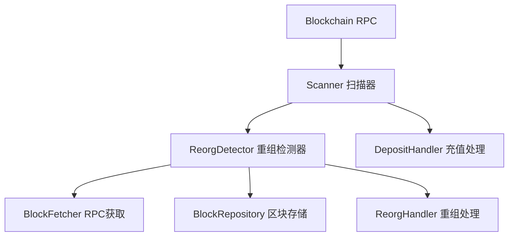
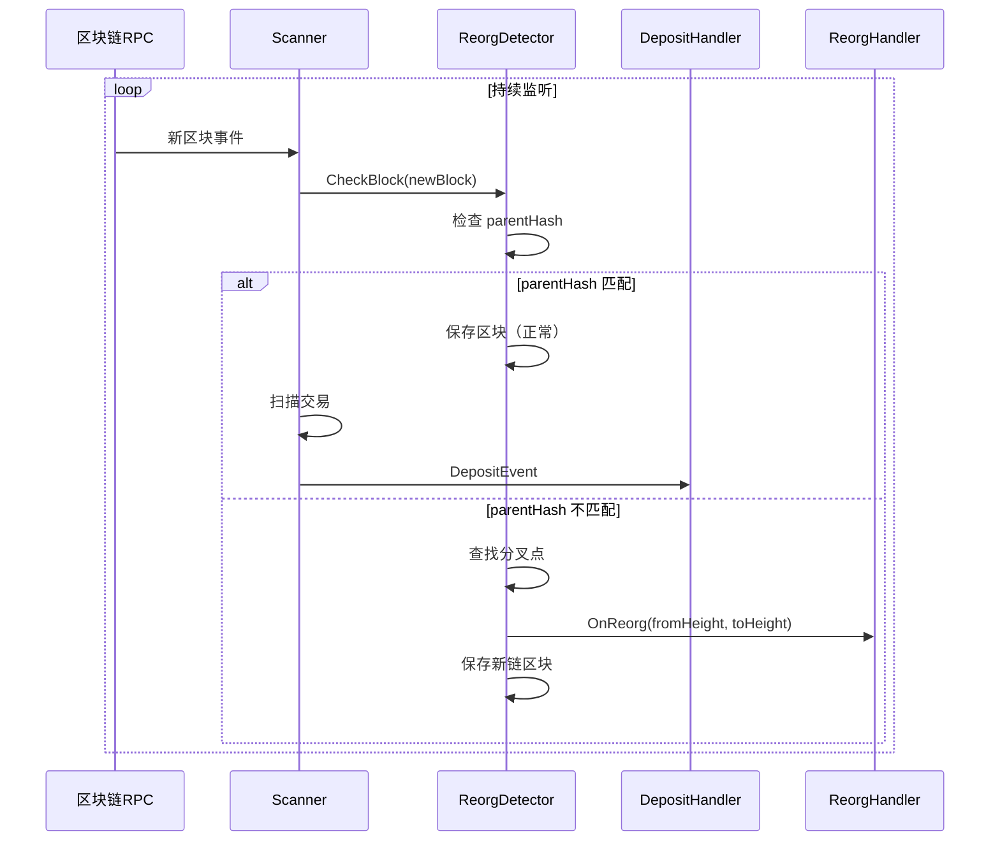
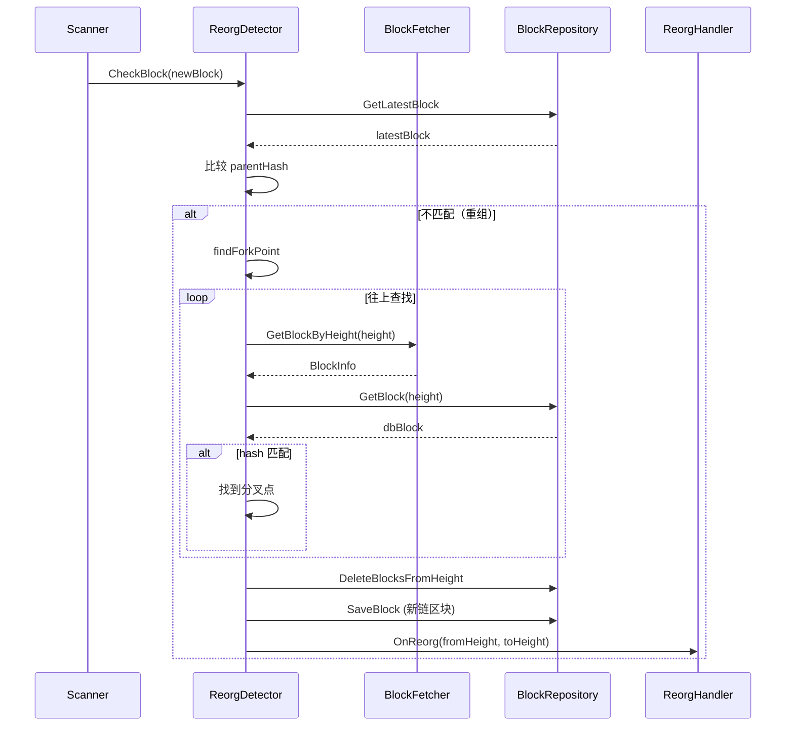
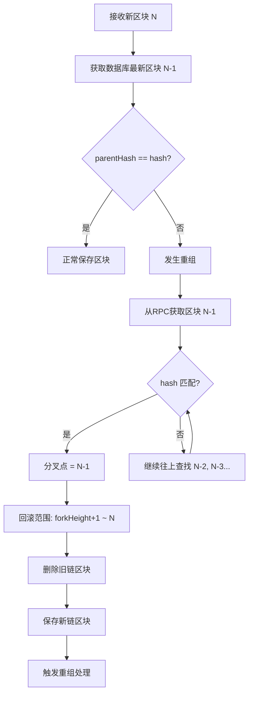

# Scanner 模块 - 区块链扫描器

扫描器模块负责监听区块链新区块，检测充值交易和区块重组。

## 📋 功能概述

1. **区块监听**：订阅新区块事件
2. **交易扫描**：检测充值交易
3. **重组检测**：基于 `parentHash` 精确检测区块重组
4. **事件分发**：将充值事件和重组事件分发给处理器

## 🏗️ 架构设计



## 🔄 核心流程

### 区块扫描流程



### 重组检测流程



## 📖 核心组件

### Scanner

扫描器接口，负责监听新区块。

**接口**：
```go
type Scanner interface {
    Chain() domain.ChainType
    Subscribe(ctx context.Context, handler DepositHandler, reorgHandler ReorgHandler) error
    SetBlockFetcher(fetcher BlockFetcher)
}
```

**实现要点**：
- 订阅新区块事件（WebSocket 或轮询）
- 扫描区块中的交易
- 检测充值交易
- 调用 DepositHandler 处理充值

### ReorgDetector

重组检测器，基于 `parentHash` 精确检测重组。

**主要方法**：
- `CheckBlock`: 检查新区块是否发生重组
- `findForkPoint`: 查找分叉点

**检测原理**：
1. 接收新区块，获取数据库中最新区块
2. 比较 `newBlock.ParentHash == latestBlock.Hash`
3. 如果不匹配，从 RPC 往上查找分叉点
4. 确定回滚范围，触发重组处理

### BlockFetcher

从 RPC 获取区块信息的接口。

**接口**：
```go
type BlockFetcher interface {
    GetBlockByHeight(ctx context.Context, height uint64) (BlockInfo, error)
}
```

## 💡 使用示例

### 基本使用

```go
import (
    "github.com/jinmu/go-blockchain/internal/wallet/scanner"
    "github.com/jinmu/go-blockchain/internal/wallet/deposit"
)

// 1. 实现 BlockFetcher
type EVMBlockFetcher struct {
    client *ethclient.Client
}

func (f *EVMBlockFetcher) GetBlockByHeight(ctx context.Context, height uint64) (scanner.BlockInfo, error) {
    block, err := f.client.BlockByNumber(ctx, big.NewInt(int64(height)))
    if err != nil {
        return scanner.BlockInfo{}, err
    }
    return scanner.BlockInfo{
        Height:     block.Number().Uint64(),
        Hash:       block.Hash().Hex(),
        ParentHash: block.ParentHash().Hex(),
    }, nil
}

// 2. 创建重组检测器
fetcher := &EVMBlockFetcher{client: ethClient}
reorgHandler := func(ctx context.Context, chain domain.ChainType, fromHeight, toHeight uint64) error {
    return depositProcessor.HandleReorg(ctx, chain, fromHeight, toHeight)
}

detector := scanner.NewReorgDetector(
    domain.ChainEVM,
    store,        // BlockRepository
    fetcher,      // BlockFetcher
    reorgHandler, // ReorgHandler
)

// 3. 实现 Scanner
type EVMScanner struct {
    detector *scanner.ReorgDetector
    handler  scanner.DepositHandler
}

func (s *EVMScanner) Subscribe(ctx context.Context, handler scanner.DepositHandler, reorgHandler scanner.ReorgHandler) error {
    s.handler = handler
    
    // 订阅新区块
    headers := make(chan *types.Header)
    sub, err := s.client.SubscribeNewHead(ctx, headers)
    if err != nil {
        return err
    }
    
    for {
        select {
        case header := <-headers:
            block, _ := s.client.BlockByHash(ctx, header.Hash())
            blockInfo := scanner.BlockInfo{
                Height:     block.Number().Uint64(),
                Hash:       block.Hash().Hex(),
                ParentHash: block.ParentHash().Hex(),
            }
            
            // 检测重组
            isReorg, fromHeight, toHeight, err := s.detector.CheckBlock(ctx, blockInfo)
            if err != nil {
                log.Printf("Reorg detection error: %v", err)
                continue
            }
            
            if isReorg {
                log.Printf("Reorg detected: from %d to %d", fromHeight, toHeight)
            }
            
            // 扫描交易
            s.scanTransactions(ctx, block)
            
        case err := <-sub.Err():
            return err
        case <-ctx.Done():
            return ctx.Err()
        }
    }
}

func (s *EVMScanner) scanTransactions(ctx context.Context, block *types.Block) {
    for _, tx := range block.Transactions() {
        // 检测充值交易
        if s.isDepositTx(tx) {
            event := domain.DepositEvent{
                Chain:       domain.ChainEVM,
                AssetSymbol: "ETH",
                TxHash:      tx.Hash().Hex(),
                BlockHeight: block.Number().Uint64(),
                // ... 其他字段
            }
            s.handler(ctx, event)
        }
    }
}
```

## 📊 重组检测原理



## ⚠️ 注意事项

1. **RPC 限流**：查找分叉点需要多次 RPC 调用，注意限流
2. **查找深度**：设置最大查找深度（默认 100），避免无限循环
3. **并发安全**：重组检测和处理期间需要加锁
4. **错误处理**：如果找不到分叉点，使用安全策略
5. **性能优化**：批量查询区块，减少 RPC 调用

## 🔧 扩展

可以通过实现接口来扩展功能：

1. **自定义扫描器**：实现 `Scanner` 接口，支持不同链
2. **自定义区块获取**：实现 `BlockFetcher` 接口
3. **自定义重组处理**：实现 `ReorgHandler` 接口

## 📚 详细文档

- [reorg_detector_example.md](./reorg_detector_example.md) - 重组检测器详细说明

