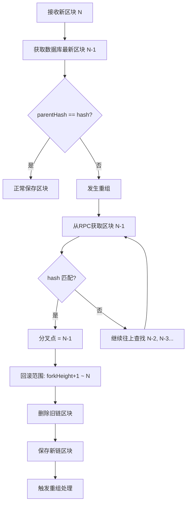

# 重组检测器使用说明

## 📋 设计原理

基于 `parentHash` 的精确重组检测：

1. **接收新区块**：扫描器接收到新的区块信息
2. **检查 parentHash**：比较新区块的 `parentHash` 和数据库中存储的上一个区块的 `hash`
3. **判断重组**：
   - 如果 `parentHash == 上一个区块.hash`：没有重组，正常保存
   - 如果 `parentHash != 上一个区块.hash`：发生重组，需要回滚

4. **查找分叉点**：从 RPC 往上查找，直到找到 `parentHash` 和数据库存储的区块 `hash` 匹配
5. **回滚范围**：从分叉点（fromHeight）到当前区块（toHeight）的所有交易都需要回滚

## 使用示例

```go
// 1. 实现 BlockFetcher 接口（从 RPC 获取区块）
type EVMBlockFetcher struct {
    client *ethclient.Client
}

func (f *EVMBlockFetcher) GetBlockByHeight(ctx context.Context, height uint64) (scanner.BlockInfo, error) {
    block, err := f.client.BlockByNumber(ctx, big.NewInt(int64(height)))
    if err != nil {
        return scanner.BlockInfo{}, err
    }
    return scanner.BlockInfo{
        Height:     block.Number().Uint64(),
        Hash:       block.Hash().Hex(),
        ParentHash: block.ParentHash().Hex(),
    }, nil
}

// 2. 创建重组检测器
fetcher := &EVMBlockFetcher{client: ethClient}
reorgHandler := func(ctx context.Context, chain domain.ChainType, fromHeight, toHeight uint64) error {
    // 调用 deposit.Processor 处理重组
    return processor.HandleReorg(ctx, chain, fromHeight, toHeight)
}

detector := scanner.NewReorgDetector(
    domain.ChainEVM,
    store,        // BlockRepository
    fetcher,      // BlockFetcher
    reorgHandler, // ReorgHandler
)

// 3. 在扫描器中检测每个新区块
func (s *EVMScanner) processNewBlock(ctx context.Context, block BlockInfo) error {
    isReorg, fromHeight, toHeight, err := detector.CheckBlock(ctx, block)
    if err != nil {
        return err
    }
    
    if isReorg {
        log.Printf("Reorg detected: from %d to %d", fromHeight, toHeight)
        // 重组处理已经在 CheckBlock 中自动触发
    }
    
    // 继续处理新区块中的交易
    return s.processTransactions(ctx, block)
}
```

## 🔄 工作流程

### 流程图



### 详细步骤

```
接收新区块 (height=N, parentHash=PH_N)
    ↓
获取数据库中最新区块 (height=N-1, hash=H_N-1)
    ↓
比较: PH_N == H_N-1?
    ↓
    ├─ 是 → 没有重组，保存新区块
    │
    └─ 否 → 发生重组
           ↓
       从 RPC 获取区块 N-1 (hash=H_N-1_new)
           ↓
       查找数据库中区块 N-1 (hash=H_N-1_old)
           ↓
       H_N-1_new != H_N-1_old → 继续往上查找
           ↓
       从 RPC 获取区块 N-2, N-3, ...
           ↓
       直到找到匹配的区块 (分叉点 = forkHeight)
           ↓
       回滚范围: [forkHeight+1, N]
           ↓
       删除数据库中的区块 [forkHeight+1, N]
           ↓
       保存新链上的区块 [forkHeight+1, N]
           ↓
       触发重组处理: OnReorg(chain, forkHeight+1, N)
```

## 关键点

1. **精确检测**：通过 `parentHash` 精确判断是否发生重组
2. **自动查找分叉点**：从 RPC 往上查找，直到找到匹配点
3. **精确回滚范围**：只回滚实际受影响的区块范围，而不是固定深度
4. **数据一致性**：删除旧链区块，保存新链区块，确保数据库和链状态一致

## 注意事项

1. **RPC 调用限制**：查找分叉点可能需要多次 RPC 调用，注意限流
2. **查找深度限制**：设置最大查找深度（如 100 个区块），避免无限循环
3. **并发安全**：重组检测和处理期间，相关区块应该加锁
4. **错误处理**：如果找不到分叉点，使用安全策略（如回滚所有新区块）

