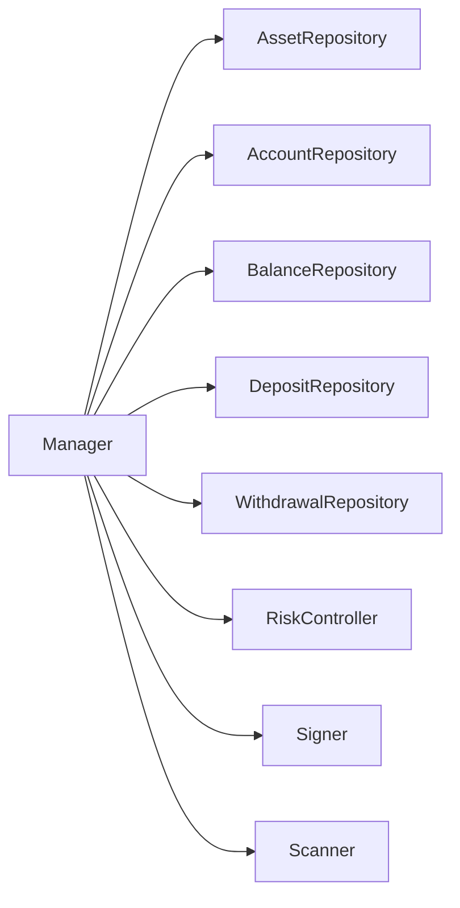
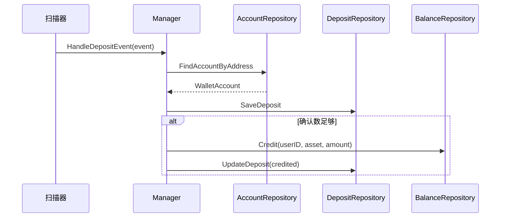
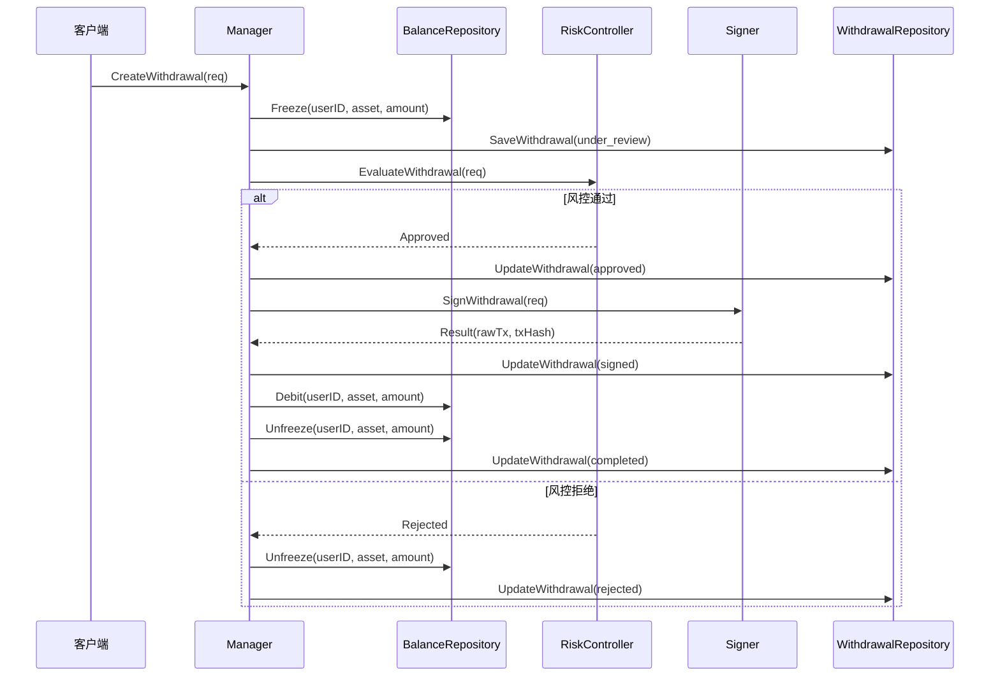
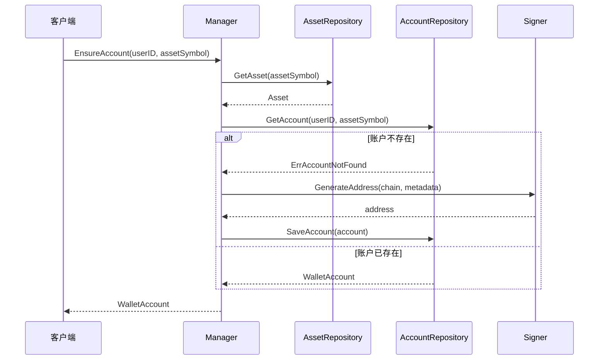

# Service 模块 - 核心业务服务

`Manager` 是钱包系统的核心业务服务，负责协调各个模块完成充值、提现、账户管理等核心功能。

## 📋 功能概述

`Manager` 提供以下核心功能：

1. **资产管理**：注册和查询资产配置
2. **账户管理**：为用户创建和管理钱包账户
3. **充值处理**：监听充值事件，自动入账
4. **提现处理**：审批和执行用户提现请求
5. **余额管理**：查询余额、转账等操作

## 🏗️ 架构设计



## 🔄 核心流程

### 充值流程



### 提现流程



### 账户创建流程



## 📖 API 文档

### RegisterAsset

注册新的资产配置。

```go
func (m *Manager) RegisterAsset(ctx context.Context, asset domain.Asset) error
```

**参数**：
- `asset`: 资产配置信息

**示例**：
```go
err := manager.RegisterAsset(ctx, domain.Asset{
    Symbol:    "ETH",
    Chain:     domain.ChainEVM,
    Decimals:  18,
    TokenAddr: "", // 原生币为空
})
```

### EnsureAccount

为用户创建钱包账户（如果不存在）。

```go
func (m *Manager) EnsureAccount(ctx context.Context, userID string, assetSymbol string) (domain.WalletAccount, error)
```

**参数**：
- `userID`: 用户ID
- `assetSymbol`: 资产符号

**返回**：
- `WalletAccount`: 钱包账户信息（包含充值地址）

**示例**：
```go
account, err := manager.EnsureAccount(ctx, "user123", "ETH")
fmt.Printf("User deposit address: %s\n", account.Address)
```

### HandleDepositEvent

处理扫描器检测到的充值事件。

```go
func (m *Manager) HandleDepositEvent(ctx context.Context, event domain.DepositEvent) error
```

**参数**：
- `event`: 充值事件信息

**处理逻辑**：
1. 根据地址查找用户账户
2. 保存充值记录
3. 如果确认数足够，自动入账

### CreateWithdrawal

创建并处理提现请求。

```go
func (m *Manager) CreateWithdrawal(ctx context.Context, req domain.WithdrawalRequest) (domain.WithdrawalRequest, error)
```

**参数**：
- `req`: 提现请求

**返回**：
- 处理后的提现请求（包含签名结果和交易哈希）

**状态流转**：
```
requested → under_review → approved → signed → completed
                              ↓
                          rejected
```

### GetBalance

查询用户余额。

```go
func (m *Manager) GetBalance(ctx context.Context, userID, asset string) (domain.Balance, error)
```

**返回**：
- `Balance`: 包含可用余额、冻结余额、待处理余额

### RollbackDeposit

回滚单笔充值（用于重组处理）。

```go
func (m *Manager) RollbackDeposit(ctx context.Context, record domain.DepositRecord) error
```

## 🔧 配置选项

### WithRiskController

指定风控实现。

```go
manager := service.NewManager(store,
    service.WithRiskController(customRiskController),
)
```

### WithSigner

指定签名机实现。

```go
manager := service.NewManager(store,
    service.WithSigner(customSigner),
)
```

## 💡 使用示例

### 完整示例

```go
package main

import (
    "context"
    "fmt"
    "math/big"
    
    "github.com/jinmu/go-blockchain/internal/wallet/domain"
    "github.com/jinmu/go-blockchain/internal/wallet/service"
    "github.com/jinmu/go-blockchain/internal/wallet/store"
)

func main() {
    ctx := context.Background()
    
    // 1. 创建仓储和管理器
    store := store.NewInMemoryStore()
    manager := service.NewManager(store)
    
    // 2. 注册资产
    err := manager.RegisterAsset(ctx, domain.Asset{
        Symbol:   "ETH",
        Chain:    domain.ChainEVM,
        Decimals: 18,
    })
    if err != nil {
        panic(err)
    }
    
    // 3. 创建用户账户
    account, err := manager.EnsureAccount(ctx, "user123", "ETH")
    if err != nil {
        panic(err)
    }
    fmt.Printf("User deposit address: %s\n", account.Address)
    
    // 4. 处理充值（通常由扫描器调用）
    err = manager.HandleDepositEvent(ctx, domain.DepositEvent{
        Chain:       domain.ChainEVM,
        AssetSymbol: "ETH",
        ToAddress:   account.Address,
        Amount:      big.NewInt(1000000000000000000), // 1 ETH
        TxHash:      "0x123...",
        BlockHeight: 12345,
        Confirmations: 12,
    })
    if err != nil {
        panic(err)
    }
    
    // 5. 查询余额
    balance, err := manager.GetBalance(ctx, "user123", "ETH")
    if err != nil {
        panic(err)
    }
    fmt.Printf("Available: %s\n", balance.Available.String())
    
    // 6. 创建提现
    req := domain.WithdrawalRequest{
        ID:          "withdraw-001",
        UserID:      "user123",
        AssetSymbol: "ETH",
        Chain:       domain.ChainEVM,
        ToAddress:   "0x456...",
        Amount:      big.NewInt(500000000000000000), // 0.5 ETH
    }
    
    result, err := manager.CreateWithdrawal(ctx, req)
    if err != nil {
        panic(err)
    }
    fmt.Printf("Withdrawal status: %s, TxHash: %s\n", result.Status, result.TxHash)
}
```

## ⚠️ 注意事项

1. **并发安全**：`Manager` 本身不保证并发安全，需要由调用方或仓储层保证
2. **错误处理**：所有方法都可能返回错误，需要妥善处理
3. **上下文传递**：所有方法都需要 `context.Context`，用于超时控制和取消
4. **余额精度**：使用 `*big.Int` 处理余额，避免精度丢失

## 🔍 扩展

可以通过实现接口来扩展功能：

1. **自定义仓储**：实现 `RepositoryProvider` 接口
2. **自定义风控**：实现 `risk.Controller` 接口
3. **自定义签名机**：实现 `signer.Signer` 接口

