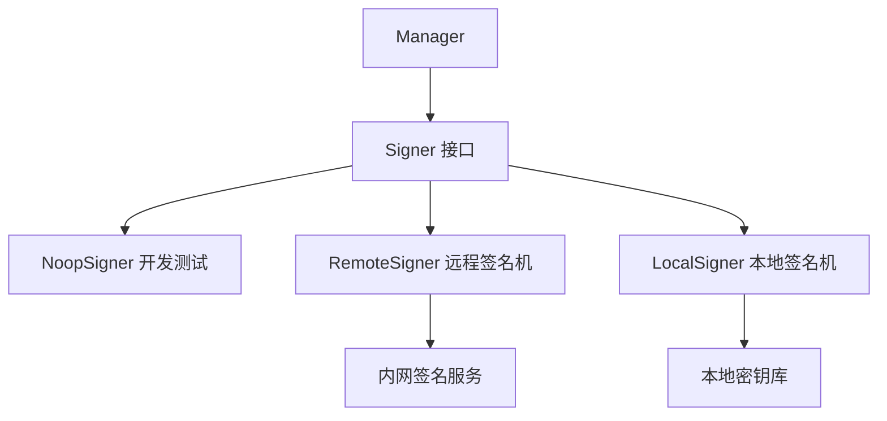
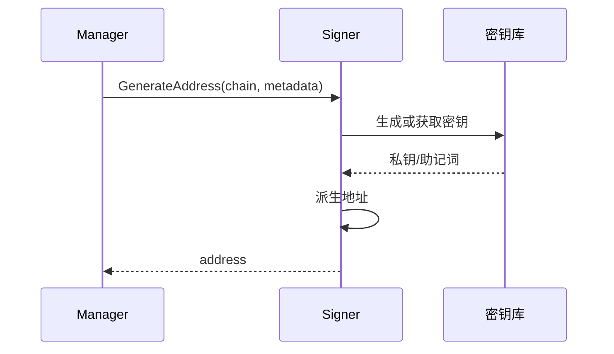
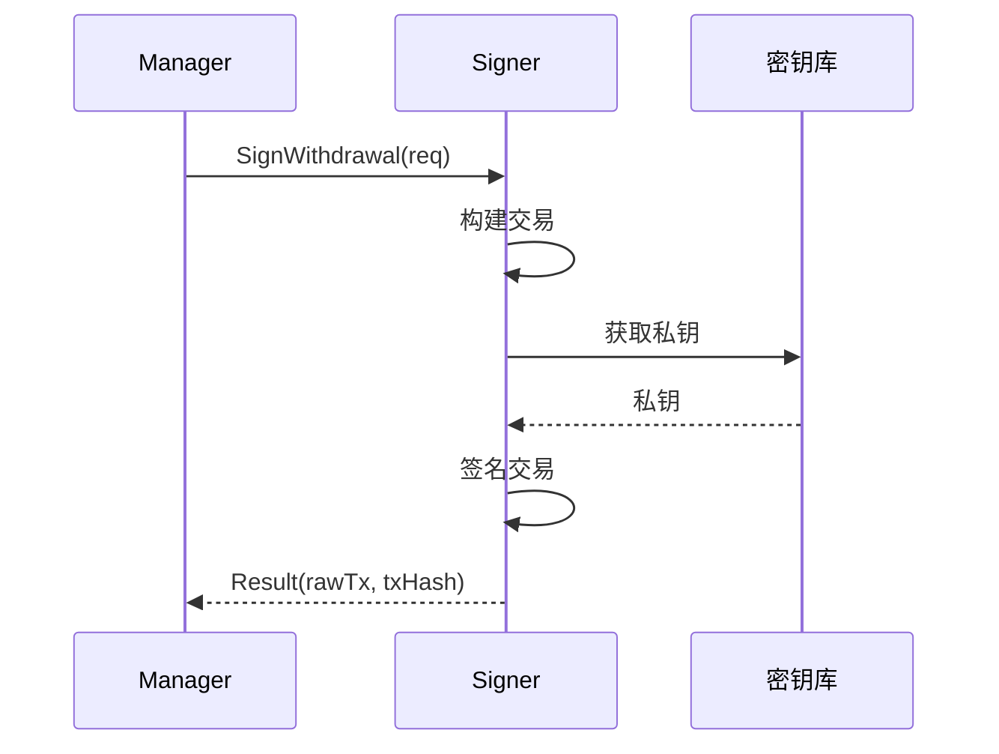

# Signer 模块 - 签名机

签名机模块抽象了私钥管理和交易签名功能，实现私钥隔离。

## 📋 功能概述

1. **地址生成**：为用户生成唯一的充值地址
2. **交易签名**：签名提现交易
3. **私钥隔离**：私钥存储在签名机，不暴露给业务系统

## 🏗️ 架构设计



## 🔄 核心流程

### 地址生成流程



### 交易签名流程



## 📖 接口说明

### Signer 接口

```go
type Signer interface {
    GenerateAddress(ctx context.Context, chain domain.ChainType, metadata map[string]string) (string, error)
    SignWithdrawal(ctx context.Context, req domain.WithdrawalRequest) (Result, error)
}
```

### Result 结构

```go
type Result struct {
    RawTx    []byte            // 签名后的原始交易
    TxHash   string            // 交易哈希
    Metadata map[string]string // 额外元数据
}
```

## 💡 使用示例

### 使用默认实现（开发测试）

```go
import (
    "github.com/jinmu/go-blockchain/internal/wallet/signer"
    "github.com/jinmu/go-blockchain/internal/wallet/service"
)

// 使用 NoopSigner（仅用于开发测试）
manager := service.NewManager(store,
    service.WithSigner(signer.NoopSigner{}),
)
```

### 实现远程签名机

```go
type RemoteSigner struct {
    client *http.Client
    url    string
}

func (s *RemoteSigner) GenerateAddress(ctx context.Context, chain domain.ChainType, metadata map[string]string) (string, error) {
    req := GenerateAddressRequest{
        Chain:    chain,
        Metadata: metadata,
    }
    
    resp, err := s.client.Post(s.url+"/generate-address", "application/json", req)
    if err != nil {
        return "", err
    }
    
    var result GenerateAddressResponse
    json.NewDecoder(resp.Body).Decode(&result)
    return result.Address, nil
}

func (s *RemoteSigner) SignWithdrawal(ctx context.Context, req domain.WithdrawalRequest) (signer.Result, error) {
    // 调用远程签名服务
    // ...
}
```

### 实现本地签名机

```go
import (
    "github.com/ethereum/go-ethereum/accounts/keystore"
    "github.com/ethereum/go-ethereum/crypto"
)

type LocalSigner struct {
    keyStore *keystore.KeyStore
    password string
}

func (s *LocalSigner) GenerateAddress(ctx context.Context, chain domain.ChainType, metadata map[string]string) (string, error) {
    account, err := s.keyStore.NewAccount(s.password)
    if err != nil {
        return "", err
    }
    return account.Address.Hex(), nil
}

func (s *LocalSigner) SignWithdrawal(ctx context.Context, req domain.WithdrawalRequest) (signer.Result, error) {
    // 使用本地密钥库签名
    // ...
}
```

## 🔒 安全设计

### 1. 私钥隔离

- 私钥存储在签名机，不暴露给业务系统
- 签名机部署在内网，不直接暴露于公网
- 使用 HTTPS 或 gRPC 加密通信

### 2. 访问控制

- 签名机需要身份验证
- 限制签名权限和频率
- 记录所有签名操作日志

### 3. 密钥管理

- 使用硬件安全模块（HSM）
- 支持多签钱包
- 定期轮换密钥

## ⚠️ 注意事项

1. **生产环境**：绝对不要使用 `NoopSigner`，必须使用真实的签名机
2. **网络安全**：签名机应该部署在内网，通过 VPN 或专线访问
3. **密钥备份**：妥善备份助记词和私钥
4. **访问控制**：限制签名机的访问权限
5. **监控告警**：监控签名机的可用性和签名失败率

## 🔧 扩展

可以通过实现 `Signer` 接口来支持：

1. **硬件钱包**：Ledger、Trezor 等
2. **云签名服务**：AWS KMS、Azure Key Vault 等
3. **多签钱包**：Gnosis Safe、MultiSig 等
4. **MPC 签名**：多方计算签名

