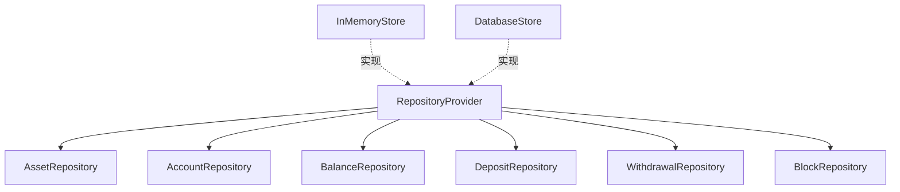

# Store 模块 - 数据仓储层

数据仓储层提供数据访问抽象，支持内存实现和数据库实现。

## 📋 功能概述

提供统一的数据访问接口，包括：

1. **资产管理**：资产配置的增删改查
2. **账户管理**：用户钱包账户管理
3. **余额管理**：余额的增减、冻结、解冻
4. **充值记录**：充值记录的保存和查询
5. **提现记录**：提现请求的保存和更新
6. **区块信息**：区块信息的存储（用于重组检测）

## 🏗️ 架构设计



## 📖 接口说明

### AssetRepository

资产管理接口。

```go
type AssetRepository interface {
    SaveAsset(ctx context.Context, asset domain.Asset) error
    GetAsset(ctx context.Context, symbol string) (domain.Asset, error)
    ListAssets(ctx context.Context) ([]domain.Asset, error)
}
```

### AccountRepository

账户管理接口。

```go
type AccountRepository interface {
    SaveAccount(ctx context.Context, account domain.WalletAccount) error
    GetAccount(ctx context.Context, userID, asset string) (domain.WalletAccount, error)
    FindAccountByAddress(ctx context.Context, address, asset string) (domain.WalletAccount, error)
}
```

### BalanceRepository

余额管理接口。

```go
type BalanceRepository interface {
    Credit(ctx context.Context, userID, asset string, amount *big.Int) error
    Debit(ctx context.Context, userID, asset string, amount *big.Int) error
    Freeze(ctx context.Context, userID, asset string, amount *big.Int) error
    Unfreeze(ctx context.Context, userID, asset string, amount *big.Int) error
    GetBalance(ctx context.Context, userID, asset string) (domain.Balance, error)
}
```

**余额状态**：
- `Available`: 可用余额
- `Frozen`: 冻结余额（提现时冻结）
- `Pending`: 待处理余额

### DepositRepository

充值记录接口。

```go
type DepositRepository interface {
    SaveDeposit(ctx context.Context, userID string, record domain.DepositRecord) error
    GetDeposit(ctx context.Context, txHash string) (domain.DepositRecord, error)
    UpdateDeposit(ctx context.Context, record domain.DepositRecord) error
    FindDepositsByBlockRange(ctx context.Context, chain domain.ChainType, fromHeight, toHeight uint64) ([]domain.DepositRecord, error)
}
```

### WithdrawalRepository

提现记录接口。

```go
type WithdrawalRepository interface {
    SaveWithdrawal(ctx context.Context, req domain.WithdrawalRequest) error
    UpdateWithdrawal(ctx context.Context, req domain.WithdrawalRequest) error
    GetWithdrawal(ctx context.Context, id string) (domain.WithdrawalRequest, error)
}
```

### BlockRepository

区块信息接口（用于重组检测）。

```go
type BlockRepository interface {
    SaveBlock(ctx context.Context, chain domain.ChainType, height uint64, hash string, parentHash string) error
    GetBlock(ctx context.Context, chain domain.ChainType, height uint64) (BlockInfo, error)
    GetLatestBlock(ctx context.Context, chain domain.ChainType) (BlockInfo, error)
    DeleteBlocksFromHeight(ctx context.Context, chain domain.ChainType, fromHeight uint64) error
}
```

## 💡 使用示例

### 使用内存实现

```go
import (
    "github.com/jinmu/go-blockchain/internal/wallet/store"
)

// 创建内存仓储
store := store.NewInMemoryStore()

// 使用仓储
err := store.SaveAsset(ctx, domain.Asset{
    Symbol: "ETH",
    Chain:  domain.ChainEVM,
})

asset, err := store.GetAsset(ctx, "ETH")
```

### 实现数据库仓储

```go
type DatabaseStore struct {
    db *sql.DB
}

func (s *DatabaseStore) SaveAsset(ctx context.Context, asset domain.Asset) error {
    query := `INSERT INTO assets (symbol, chain, decimals) VALUES (?, ?, ?)`
    _, err := s.db.ExecContext(ctx, query, asset.Symbol, asset.Chain, asset.Decimals)
    return err
}

func (s *DatabaseStore) GetAsset(ctx context.Context, symbol string) (domain.Asset, error) {
    query := `SELECT symbol, chain, decimals FROM assets WHERE symbol = ?`
    row := s.db.QueryRowContext(ctx, query, symbol)
    
    var asset domain.Asset
    err := row.Scan(&asset.Symbol, &asset.Chain, &asset.Decimals)
    return asset, err
}

// 实现其他接口...
```

## ⚠️ 注意事项

1. **并发安全**：确保所有操作是并发安全的
2. **事务支持**：关键操作应该支持事务
3. **错误处理**：返回明确的错误类型
4. **性能优化**：批量操作、索引优化等
5. **数据一致性**：确保余额操作的一致性

## 🔧 扩展

实现 `RepositoryProvider` 接口，可以替换为任何数据库实现：

- MySQL/PostgreSQL
- MongoDB
- Redis（缓存层）
- 分布式数据库

