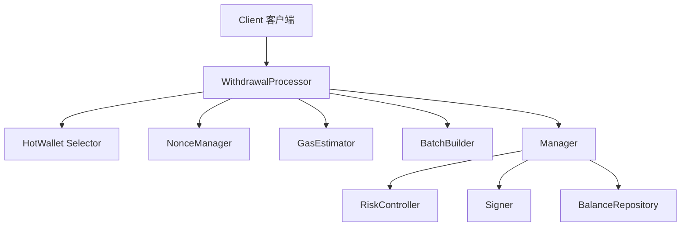
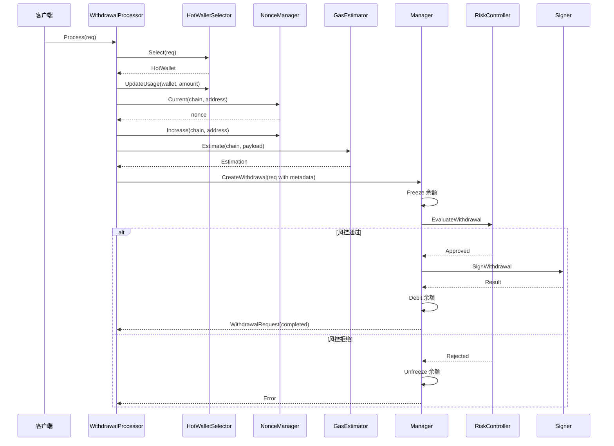
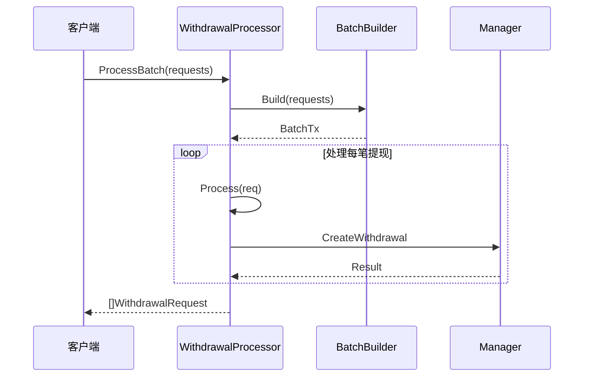
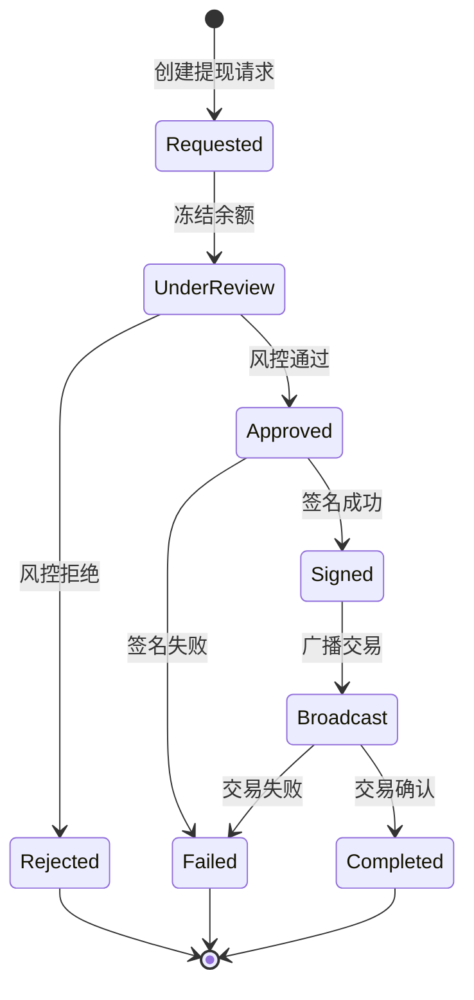

# Withdrawal 模块 - 提现处理

提现模块负责处理用户提现流程，包括热钱包选择、Nonce 管理、Gas 估算、批量交易等。

## 📋 功能概述

1. **热钱包选择**：根据余额、限额、优先级选择合适的热钱包
2. **Nonce 管理**：避免交易冲突，确保交易顺序
3. **Gas 估算**：使用 ETH `feeHistory` API 估算合理的手续费
4. **批量交易**：支持 EIP-7702 等批量交易协议
5. **提现执行**：协调风控、签名、余额扣减等流程

## 🏗️ 架构设计



## 🔄 核心流程

### 提现处理流程



### 批量提现流程



## 📖 核心组件

### Processor

提现处理器，协调各个组件完成提现流程。

**主要方法**：
- `Process`: 处理单笔提现
- `ProcessBatch`: 处理批量提现

### HotWalletSelector

热钱包选择器，根据策略选择合适的热钱包。

**接口**：
```go
type Selector interface {
    Select(ctx context.Context, req domain.WithdrawalRequest) (HotWallet, error)
    UpdateUsage(ctx context.Context, wallet HotWallet, amount *big.Int) error
}
```

**选择策略**：
- 余额充足
- 未超过日限额
- 优先级高
- 可用性良好

### NonceManager

Nonce 管理器，避免交易冲突。

**接口**：
```go
type NonceManager interface {
    Current(ctx context.Context, chain domain.ChainType, address string) (uint64, error)
    Increase(ctx context.Context, chain domain.ChainType, address string) error
}
```

**实现要点**：
- 从链上获取当前 Nonce
- 本地维护 Nonce 计数器
- 确保交易顺序

### GasEstimator

Gas 估算器，获取合理的手续费。

**接口**：
```go
type GasEstimator interface {
    Estimate(ctx context.Context, chain domain.ChainType, payload map[string]interface{}) (Estimation, error)
}
```

**估算方法**：
- 使用 `eth_feeHistory` API
- 计算 BaseFee 和 PriorityFee
- 考虑网络拥堵情况

### BatchBuilder

批量交易构建器，支持 EIP-7702 等协议。

**接口**：
```go
type BatchBuilder interface {
    Build(ctx context.Context, requests []domain.WithdrawalRequest) ([]byte, error)
}
```

## 💡 使用示例

### 基本使用

```go
import (
    "github.com/jinmu/go-blockchain/internal/wallet/withdrawal"
    "github.com/jinmu/go-blockchain/internal/wallet/service"
)

// 1. 创建组件
manager := service.NewManager(store)
selector := NewHotWalletSelector()  // 实现 Selector
nonces := NewNonceManager()          // 实现 NonceManager
gas := NewGasEstimator()             // 实现 GasEstimator

// 2. 创建提现处理器
processor := withdrawal.NewProcessor(
    manager,
    selector,
    nonces,
    gas,
    nil, // BatchBuilder (可选)
)

// 3. 处理提现
req := domain.WithdrawalRequest{
    ID:          "withdraw-001",
    UserID:      "user123",
    AssetSymbol: "ETH",
    Chain:       domain.ChainEVM,
    ToAddress:   "0x456...",
    Amount:      big.NewInt(500000000000000000), // 0.5 ETH
}

result, err := processor.Process(ctx, req)
if err != nil {
    log.Fatal(err)
}

fmt.Printf("Withdrawal completed: %s\n", result.TxHash)
```

### 批量提现

```go
// 创建批量构建器
batchBuilder := NewEIP7702BatchBuilder()

processor := withdrawal.NewProcessor(
    manager,
    selector,
    nonces,
    gas,
    batchBuilder,
)

// 批量处理
requests := []domain.WithdrawalRequest{
    {ID: "withdraw-001", ...},
    {ID: "withdraw-002", ...},
    {ID: "withdraw-003", ...},
}

results, err := processor.ProcessBatch(ctx, requests)
```

### 自定义热钱包选择器

```go
type CustomSelector struct {
    wallets []withdrawal.HotWallet
}

func (s *CustomSelector) Select(ctx context.Context, req domain.WithdrawalRequest) (withdrawal.HotWallet, error) {
    // 选择策略：
    // 1. 余额充足
    // 2. 未超过日限额
    // 3. 优先级最高
    for _, wallet := range s.wallets {
        if wallet.AssetSymbol == req.AssetSymbol {
            if wallet.UsedAmount.Cmp(wallet.DailyLimit) < 0 {
                // 检查余额
                balance := getBalance(wallet.Address)
                if balance.Cmp(req.Amount) >= 0 {
                    return wallet, nil
                }
            }
        }
    }
    return withdrawal.HotWallet{}, errors.New("no available wallet")
}
```

## 📊 状态流转



## ⚠️ 注意事项

1. **Nonce 管理**：确保 Nonce 正确递增，避免交易冲突
2. **Gas 估算**：合理估算 Gas，避免交易失败或费用过高
3. **热钱包限额**：监控热钱包余额和日限额，及时补充
4. **批量交易**：注意批量交易的大小限制和 Gas 限制
5. **错误处理**：妥善处理各种错误，及时解冻余额

## 🔧 扩展

可以通过实现接口来扩展功能：

1. **自定义热钱包选择**：实现 `Selector` 接口
2. **自定义 Nonce 管理**：实现 `NonceManager` 接口
3. **自定义 Gas 估算**：实现 `GasEstimator` 接口
4. **自定义批量交易**：实现 `BatchBuilder` 接口

